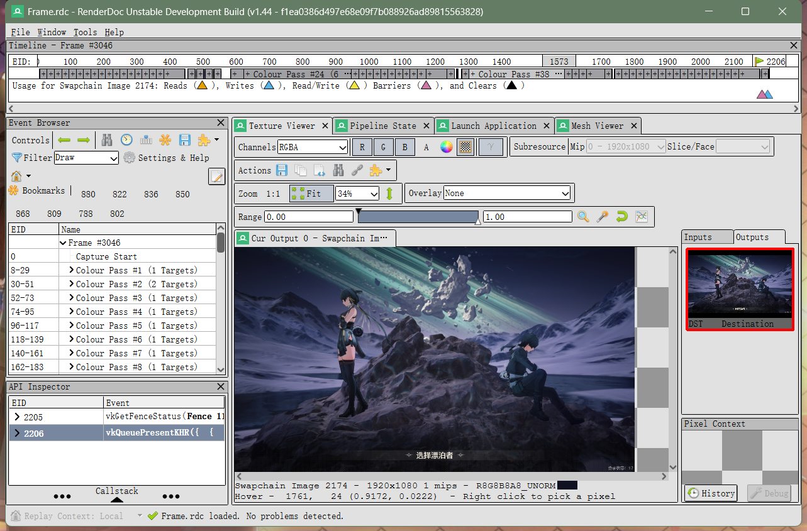
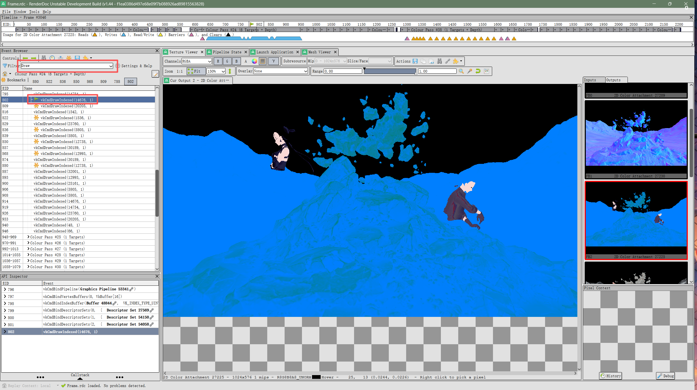
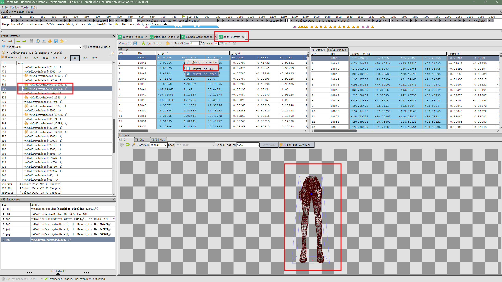
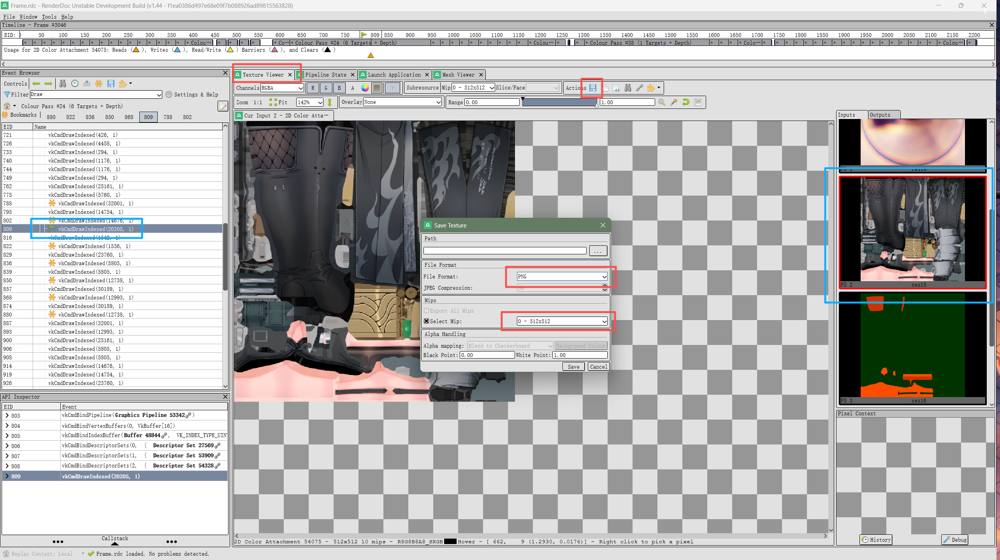
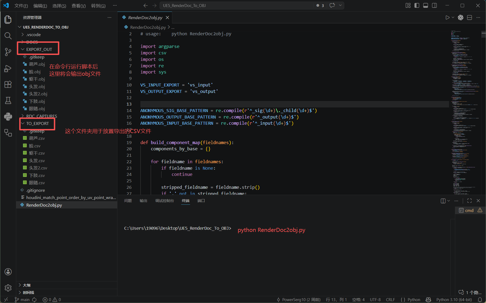
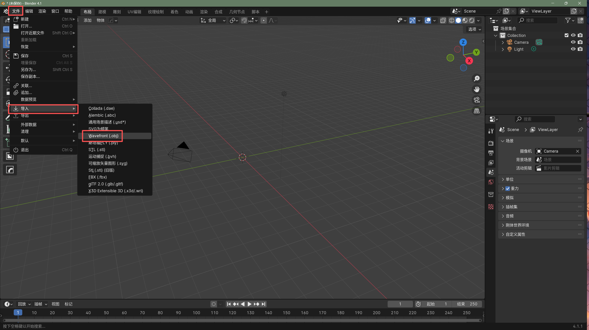
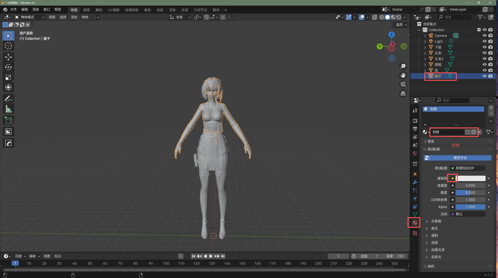
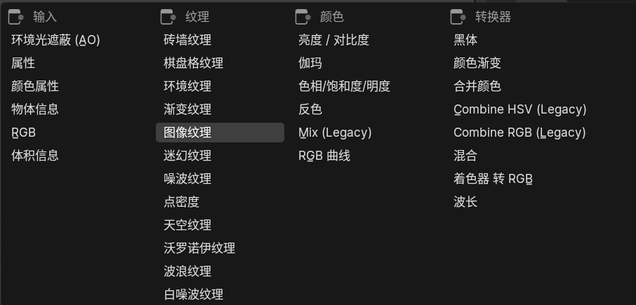
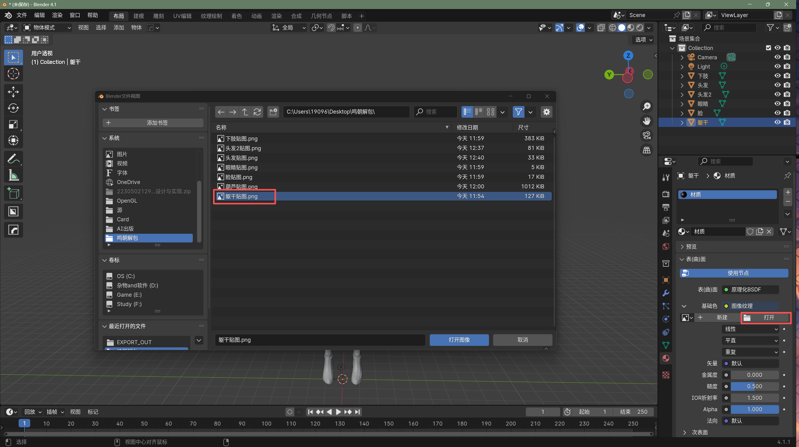
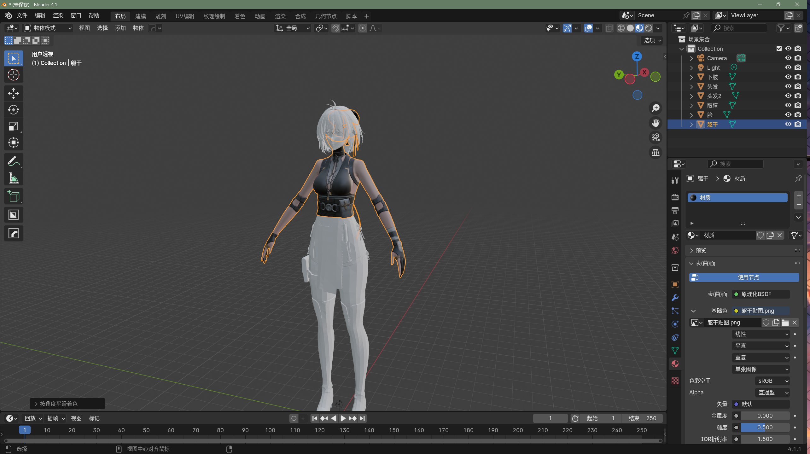

## 抓帧

首先，按照之前的教程配置好renderdoc和Mumu12模拟器，然后打开需要抓帧的游戏，进入到需要抓取的场景中，按下F12键进行抓帧

由于我并不玩鸣朝，也懒得去过新手教程啦，所以我就直接在选角界面抓了一帧用以还原啦



## 导出CSV文件

诶，首要我们就是要找到我们需要的那个模型的DrawCalls了



通过上下帧或者Mesh Viewer就可以找到我们需要的模型在哪个DrawCall里被用到了

然后选中那个DrawCall，在Mesh Viewer里右键Vs Input选择Export CSV，就可以把这个DrawCall的顶点数据导出成CSV文件了



如果需要导出贴图的话，则需要在Texture Viewer中按如下步骤去导出贴图：
- 选中需要的贴图
- 右键找到保存的按钮
- 选择PNG格式进行保存
- 注意Mips需要层级为0



## 把CSV文件转为OBJ文件

接下来我们就需要把CSV文件转为OBJ文件了，这样才能在blender中打开

这里有一个Python脚本可以帮我们把CSV文件转为OBJ文件

**Github：**[PowerSerg10/UE5_RenderDoc_To_OBJ](https://github.com/PowerSerg10/UE5_RenderDoc_To_OBJ.git)

但是它的脚本对于使用了Vulkan的鸣朝似乎有点不是很适用，于是我使用了AI对它的脚本进行了一些修改，以将我刚刚抓到的CSV文件成功转换OBJ文件

**Github：**[魔改后的脚本](https://github.com/AreSet01/UE5_RenderDoc_To_OBJ.git)

将github上的脚本下载下来之后，进入到脚本所在的目录下，将CSV文件放至TO_EXPORT目录下，使用如下命令进行转换：

```bash
python RenderDoc2obj.py
```

转换成功后会在EXPORT_OUT目录下生成OBJ文件，我们就可以在blender中打开这个OBJ文件了



## 在blender中打开OBJ文件并将贴图还原

打开blender，选择File->Import->Wavefront(.obj)，选择我们刚刚转换好的OBJ文件进行导入



模型将直接在场景中被导入，我们选中模型，进入到材质编辑界面，选择Base Color的纹理节点，在图片纹理的属性栏中选择我们之前导出的贴图（一定要对应！！！），就可以把贴图还原出来了





## 最终效果


由于是截帧模拟器的游戏，相比于PC端的游戏来说，模型的细节和贴图的质量都不是特别高，所以还原出来的模型也就只能是这个样子了，不过对于一些简单的模型来说，这个方法还是很不错的，可以用来还原一些游戏中的模型进行学习或者是二次创作等，还是很有用的