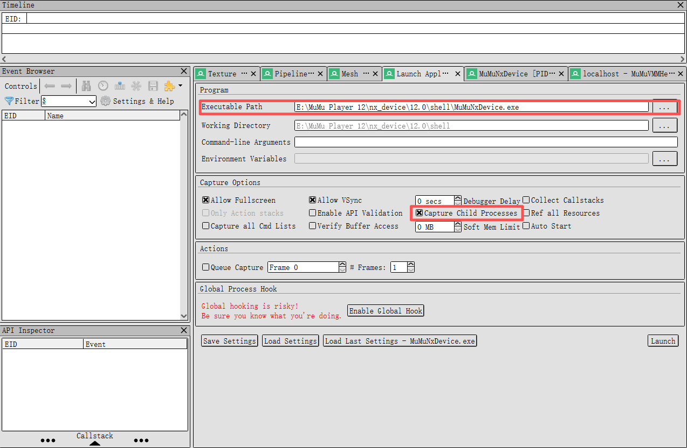
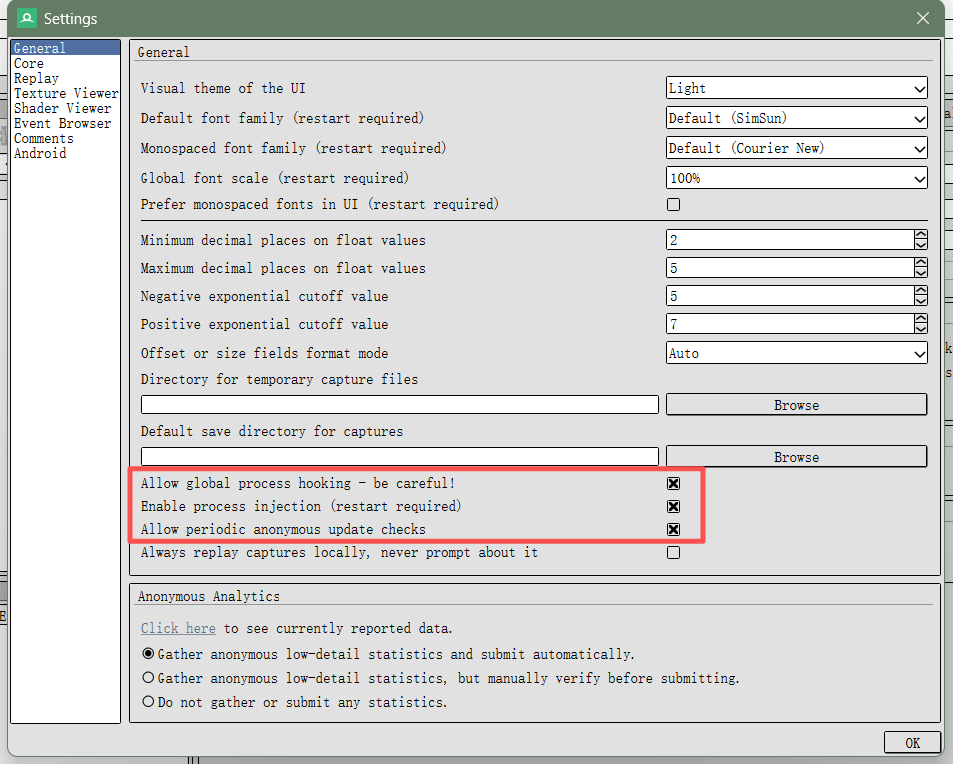
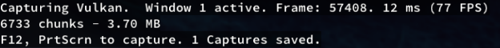

## Download Renderdoc.
首先，下载 renderdoc 的最新版本。可以从 [renderdoc 官网](https://renderdoc.org/) 获取。

或者，在GitHub中克隆最新的 renderdoc 仓库：

```bash
git clone https://github.com/baldurk/renderdoc.git
```
然后对其进行编译，但是要注意由于renderdoc使用的是2015版本的Visual Studio编译器，所以要下载对应的v140版本的编译工具链。

### why choose to compile renderdoc by yourself?

如果你想对renderdoc进行魔改，或者说是更改某些代码以绕过某些游戏厂商的反抓包措施，那么你就需要自己编译renderdoc了。

## 配置 Mumu12 模拟器

在 Mumu12 模拟器中，打开设备设置，对性能选项进行如下配置：
- **渲染模式**：选择 "Vulkan"
- **性能设置**：选择自定义，处理器和运行内存尽量拉高
- **强制使用独立显卡**：开启

然后下载好需要抓帧的游戏

## 配置 Renderdoc

打开renderdoc，将Mumu12模拟器添加到捕获列表中，Executable Path为MuMu Player 12\nx_device\12.0\shell\MuMuNxDevice.exe
 
调整如下设置：
- **Capture Child Processes**：开启
- **Tool->Setings->Allow Global Hooking**：开启
- **Enable Process Injection**：开启


## 抓帧
在 renderdoc 中，点击 "Launch" 启动即可打开Mumu12模拟器，此时左上角会出现如图所示字样，代表开启成功
