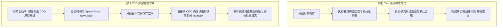
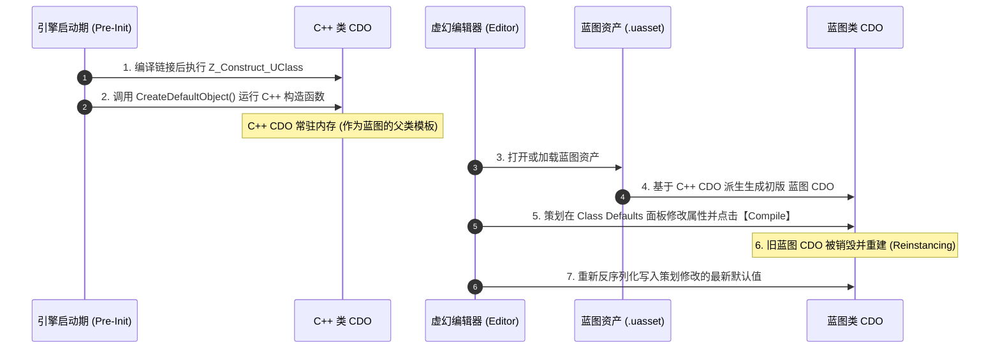
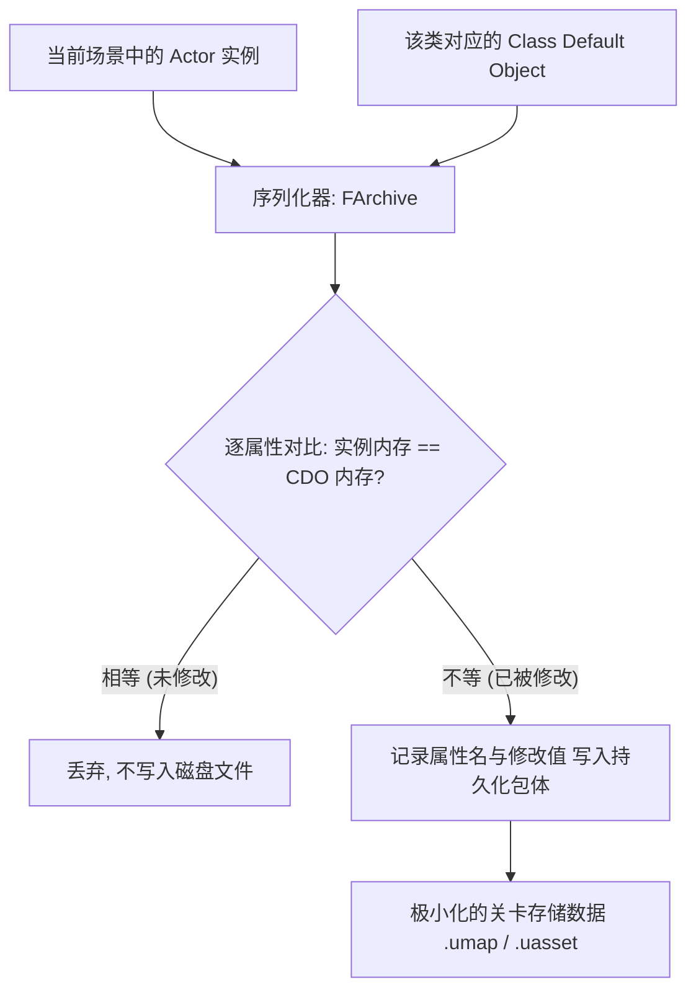
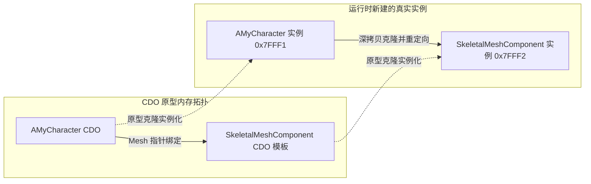

## 前言：那个既熟悉又神秘的“类模板”

在虚幻引擎（Unreal Engine）的开发世界里，只要你写过 C++ 或蓝图，就必然每分每秒都在与它打交道：
- 当你在细节面板（Details Panel）中修改一个属性，旁边出现的**黄色小重置箭头**，点击它就能瞬间还原为“默认值”；
- 当你在蓝图编辑器中打开一个 Class，顶部工具栏有一个显著的 **Class Defaults（类默认值）** 标签页；
- 当你在 C++ 中声明组件时，导师一定会千叮咛万嘱咐：“**必须在构造函数里用 `CreateDefaultSubobject`，千万别用 `NewObject`！**”；
- 偶尔，由于某位同事在代码里不小心修改了一个全局引用的属性，导致接下来整个关卡里生成的所有小怪属性全被“永久带偏”。

这一切技术现象的背后，都指向了虚幻引擎对象系统中最核心、也最常被误解的基石概念——**CDO（Class Default Object，类默认对象）**。

在上两篇专题中，我们详细解析了 [UHT 编译前端代码生成](/posts/ue5-uht-generated-code-deep-dive) 以及 [运行时元数据 UClass 与 FProperty 体系](/posts/ue5-runtime-uobject-reflection-system)。在反射类型装载的第四阶段，正是以 `UClass::CreateDefaultObject()` 为终点，孕育出了 CDO。

今天这篇专题，我们将彻底剥开 CDO 的黑盒，全面回答：
1. **虚幻为什么不采用原生 C++ 的每次 `new` 执行构造函数，而是坚定推行 CDO 原型模式？**
2. **C++ 类与蓝图类的 CDO 分别在何时、以何种方式被创建与重新装载？**
3. **Delta 差异化序列化、蓝图继承覆盖是如何依托 CDO 运转的？**
4. **构造函数中的 CDO 上下文陷阱与 CDO 数据污染该如何从架构层面杜绝？**

---

## 一、CDO 的核心概念与设计哲学

### 1. 什么是 CDO？

在虚幻引擎中，每一个继承自 `UObject` 的类型，在引擎反射系统完成注册并生成对应的 `UClass` 后，**引擎都会为其有且仅有地实例化出一个专属的全局默认对象实例**。这个实例就保存在对应 `UClass` 的内部指针中：

```cpp
// UClass 内部维护的 CDO 成员指针
UObject* UClass::ClassDefaultObject;
```

可以通过以下标准 API 随时获取某个类的 CDO：

```cpp
// 方式一：通过 StaticClass() 获取
AMyCharacter* DefaultCharacter = GetDefault<AMyCharacter>();

// 方式二：通过 UClass 实例获取
AMyCharacter* DefaultCharacter = Cast<AMyCharacter>(MyClass->GetDefaultObject());
```

每一个 CDO 本身就是一个**完全合法的、分配在堆内存上的普通 `UObject` 实例**。但不同之处在于，它被赋予了特殊的生命周期标志位：`RF_ClassDefaultObject`。

---

### 2. 原型模式（Prototype Pattern）的工业级胜利

在传统 C++ 开发中，实例化一个对象通常遵循标准的构造流程：
```
分配内存 -> 递归执行父类到子类的构造函数 -> 成员变量初始化列表求值 -> 完成对象构建
```

然而，在大型现代 3A 游戏中，如果一个关卡包含成千上万个 Actor（小兵、植被、子弹、掉落物），并且每个 Actor 身上挂载了数十个组件与复杂的数学参数计算，每次生成对象都要从头跑一遍冗长的构造函数链，CPU 开销是完全不可接受的。

虚幻引擎选择了一种经典而高效的架构设计——**原型模式（Prototype Pattern）**：



#### 原型模式带来的三大工业级红利：
1. **海量实例极速生成：** 对象的初始内存排布早就在 CDO 中被定格。生成新实例时，绝大部分默认成员变量只需要一次直接的内存拷贝（或调用极轻量的属性初始化），而无需重新执行复杂的初值计算；
2. **确定性基准参考系：** 引擎有了一面“镜子”。任何时刻，都可以拿当前运行时对象的属性与该类的 CDO 做快速比对，明确得知“哪些值被篡改了，哪些值仍然是默认的”；
3. **脱离游戏世界的数据查询：** 即使没有加载关卡、甚至没有创建 `UWorld`，只要类加载了，策划或系统就能通过 `GetDefault<T>()` 安全查询技能耗蓝、角色基础属性等配置数据。

---

## 二、CDO 的双轨生命周期：C++ 类 vs 蓝图类

CDO 并非在游戏启动时一次性全部建好，而是伴随着类的生命周期动态演化的。在虚幻中，C++ 原生类和蓝图生成类（`UBlueprintGeneratedClass`）在 CDO 的生命周期机制上有着显著差异。



---

### 1. C++ 原生类的 CDO 生命周期

对于所有通过代码编写的 C++ 类（如 `AMyCharacter`）：
- **诞生时机：** 在模块加载阶段（`ProcessNewlyLoadedUObjects` 的第四阶段），由引擎反射系统调用 `UClass::CreateDefaultObject()`；
- **构造环境：** 引擎直接以空参数调用该类的 C++ 构造函数 `AMyCharacter::AMyCharacter()`；
- **存活周期：** 一旦创建成功，常驻引擎内存直至进程退出或该 C++ 模块被显式卸载；
- **核心特征：** 它是绝对不可变的基石。后续所有基于该 C++ 类派生出的蓝图类，都以它为源头模板。

---

### 2. 蓝图生成类（UBlueprintGeneratedClass）的 CDO 生命周期

蓝图是虚幻中的“动态类”。策划在编辑器中拖拽一个蓝图，本质上是在继承体系中增加了一个 `UBlueprintGeneratedClass`：

1. **初始派生：** 当蓝图资产被反序列化载入时，它的 CDO 以其父类（可以是 C++ CDO，也可以是父蓝图 CDO）的内存为蓝本进行拷贝；
2. **应用类默认值（Class Defaults）：** 蓝图序列化器将保存在 `.uasset` 中的差异数据加载覆盖进蓝图 CDO 中；
3. **编译期重建（Recompilation & Reinstancing）：**  
   当你在编辑器中修改了蓝图的变量默认值并点击**编译（Compile）**时：
   - 引擎会先触发 **Reinstancing（重新实例化）** 机制；
   - 现有的蓝图 CDO 会被标记为垃圾并销毁；
   - 引擎开辟新的内存块，重新生成全新的蓝图 CDO；
   - 随后场景中已经放置的所有该蓝图实例，会被强制拉取最新 CDO 数据进行内存修补与重定向！

> 💡 **这也是为什么：**
> 在编辑器里修改蓝图默认值后，无需重新运行游戏，场景里所有该蓝图的 Actor 对应的未修改属性会立即同步发生改变！

---

## 三、CDO 驱动的核心引擎底层机制

CDO 绝不是一个干瘪的原型对象，它是维系虚幻引擎序列化、属性面板交互与组件架构的核心支柱。

---

### 1. Delta 差异化序列化（Delta Serialization）

在游戏开发中，存档（SaveGame）、关卡持久化（Level Streaming / SavePackage）的吞吐直接决定了包体大小和加载速度。

设想一个场景：你的角色类定义了 200 个属性，但你在某个特定关卡中放置的实例只改动了其中的 `Health = 50.0f`（默认是 `100.0f`）和 `TeamID = 2`。

如果虚幻无脑把 200 个属性全部保存进磁盘，场景文件将极其臃肿。



- **序列化规则：**  
  在执行 `UObject::Serialize` 时，序列化器会同步传入对应类的 CDO 作为参考基准（`Defaults`）。
- **字段比对：**  
  引擎会通过 `FProperty::Identical` 逐字节比对当前实例与 CDO 的内存数据。**只有发生变化的差异项（Delta），才会被真正编码进磁盘包体！**
- **加载重构：**  
  反序列化加载该 Actor 时，先直接从 CDO 拷贝出基础模板，再将磁盘中记录的极少数差异项重写进去。这种机制将虚幻关卡的存储开销降低了整整几个数量级！

---

### 2. 编辑器细节面板的“重置为默认值”

在虚幻编辑器中，为什么每个属性右边都有一个黄色小箭头？

```
WalkSpeed: [ 800.0 ] ⟲ (黄色重置箭头)
```

其背后的实现逻辑完全建立在 CDO 基础之上：
1. 编辑器的属性观察器（Property Editor）在绘制面板时，除了持有当前编辑的实例指针 `InstancePtr`，还会通过 `Instance->GetClass()->GetDefaultObject()` 拿到对应的 CDO 指针 `CDOPtr`；
2. 如果 `Property->Identical(InstancePtr, CDOPtr)` 返回 `false`，界面就高亮绘制黄色重置箭头；
3. 当用户点击该箭头时，引擎执行：
   ```cpp
   Property->CopyCompleteValue(InstancePtr, CDOPtr);
   ```
   直接把 CDO 内存对应偏移处的字节原封不动拷回当前实例，完成重置。

---

### 3. 组件子对象（Subobject）架构：为什么必须用 CreateDefaultSubobject？

许多初学者常常困惑：在 C++ 构造函数里，为什么声明组件必须用 `CreateDefaultSubobject`，而不能用 `NewObject`？

来看两者的本质区别：

| 维度 | `CreateDefaultSubobject` | `NewObject` |
| :--- | :--- | :--- |
| **所属时机** | **仅限 C++ 构造函数中调用** | 任何运行期、Gameplay 函数中调用 |
| **对 CDO 的影响** | **将组件实例挂载到 CDO 的模板树上**（作为默认子对象） | 只是在当前对象中动态分配一个普通内存实例 |
| **蓝图覆写能力** | 蓝图可以直接在组件面板查看、修改属性、甚至替换材质 | 蓝图组件列表完全不可见，无法进行任何可视化配置 |
| **实例化行为** | 主 Actor 原型拷贝时，引擎会自动克隆出组件的独立子实例 | 不会被原型机制自动克隆，容易变成空指针或悬挂指针 |



当主 Actor 的 CDO 诞生时，`CreateDefaultSubobject` 创造出的组件**本身就是该组件类的 CDO 子对象**。当主 Actor 随后在关卡中生成实例时，引擎会顺着 CDO 的默认子对象关系链，**自动递归克隆并重定向所有组件指针**！

---

## 四、3A 级工程避坑指南与高危反模式

CDO 的机制极其精密，但也正因如此，一旦开发者违反了它的生命周期契约，就会引发极为诡异的生产事故。

---

### 1. 致命天坑：构造函数中访问 `GetWorld()` 或业务系统

```cpp
// ❌ 灾难代码：在 C++ 构造函数中假设世界与系统已经就绪
AMyEnemyCharacter::AMyEnemyCharacter()
{
    PrimaryActorTick.bCanEverTick = true;

    // 💥 致命崩溃！在 CDO 创建期，GetWorld() 必定返回 nullptr！
    AGameModeBase* GM = UGameplayStatics::GetGameMode(GetWorld());
    if (GM)
    {
        MaxHealth = GM->GetDefaultEnemyHealth();
    }
}
```

#### 为什么会崩溃？
很多人以为 C++ 构造函数只在玩家进游戏、怪物刷新时执行。
**真相是：**
- 当引擎刚启动、或者在 Cook 打包、或者甚至在命令行运行某些工具时，C++ 类的 CDO 就会被立即创建；
- 在此时，**世界上根本没有任何关卡被加载，`GetWorld()` 毫无疑问返回 `nullptr`**；
- 上述代码在引擎启动或 Cook 时会直接触发空指针引用，导致整个编辑器或打包管线彻底崩溃！

> ✅ **工业级规范：**
> - **构造函数（Constructor）：** 只做纯粹的静态初值设定、组件拓扑搭建（`CreateDefaultSubobject`）、加载基础硬引用资产（`ConstructorHelpers`）；
> - **运行时世界初始化：** 所有依赖关卡世界、GameMode、玩家控制器、物理场景的逻辑，**一律后延至 `BeginPlay()` 或 `PostInitializeComponents()` 中执行**！

---

### 2. 灾难事故：CDO 数据污染（CDO Corruption）

这是中大型团队中最隐蔽、杀伤力最巨大的 Bug 之一。

#### 事故复现
某个程序员在编写一个掉落物或 Buff 系统时，写出了如下逻辑：

```cpp
// ❌ 灾难代码：无意识中修改了 CDO 内部的变量
void UBuffSystem::ApplyGlobalBuff(TSubclassOf<AMyCharacter> TargetClass)
{
    // 获取了该类型的默认对象指针
    AMyCharacter* DefaultChar = TargetClass->GetDefaultObject<AMyCharacter>();
    
    // 直接修改了 CDO 的属性！
    DefaultChar->AttackPower += 50.0f; 
}
```

#### 恶果分析
1. `DefaultChar` 指向的是常驻内存的全局唯一 CDO 原型；
2. 这一行修改，直接篡改了该类型在内存中的基础蓝本；
3. **连锁反应：**  
   接下来关卡中只要通过 `SpawnActor` 刷新出该职业的角色，其初始攻击力统统平白无故多出了 50 点；并且即使游戏结束回到主菜单，由于 CDO 没有被重新加载，这个属性值会一直被永久污染！

> 🛡️ **安全法则：**
> 任何通过 `GetDefaultObject()` 或 `GetDefault<T>()` 拿到的指针，**必须严格视作 `const` 只读对象**！绝不允许对 CDO 的成员变量进行任何运行时的写操作！

---

### 3. 构造函数动态逻辑守门防线：`HasAnyFlags(RF_ClassDefaultObject)`

有时候，我们确实有一部分构造逻辑，只希望在游戏运行时由具体的 Actor 实例去执行，而绝不希望在 CDO 诞生时触发。

此时，我们可以使用虚幻提供的专属标志位守门：

```cpp
AMyProjectile::AMyProjectile()
{
    // 基础属性与组件声明（CDO 和实例都必须执行）
    CollisionComp = CreateDefaultSubobject<USphereComponent>(TEXT("SphereComp"));
    RootComponent = CollisionComp;

    // 🛡️ 守门防线：如果当前正在构建的是 CDO 原型，直接跳过后续重型逻辑！
    if (HasAnyFlags(RF_ClassDefaultObject))
    {
        return;
    }

    // 以下代码只有真正的游戏运行实例才会执行
    TraceDebugID = FMath::RandRange(1000, 9999);
}
```

---

### 4. 动态数组容器（TArray / TMap）在构造函数中的累加陷阱

```cpp
// ⚠️ 高危代码：在构造函数中向 TArray 添加元素
AMyBaseActor::AMyBaseActor()
{
    // 如果没有清空直接 Add
    SupportedTags.Add(TEXT("BaseTag"));
}

AMyDerivedActor::AMyDerivedActor()
{
    // 派生类构造
    SupportedTags.Add(TEXT("DerivedTag"));
}
```

在蓝图反复编译重构（Reinstancing）的过程中，或者某些多重构造场景下，如果容器在每次构造时只执行 `Add` 而不进行初始化检查，容器里的元素可能会被多次叠加，导致 CDO 内部包含重复冗余的数据。

---

## 五、全景总结与核心记忆法则

为了便于工程开发与面试复习，我们用一张思维表格系统总结 CDO 的技术全貌：

| 维度 | 核心机制与特征 | 生产实践重点 |
| :--- | :--- | :--- |
| **本质定位** | 属于 `UClass` 的全局唯一原型对象实例（堆内存分配的合规 `UObject`） | 通过 `GetDefault<T>()` 随时获取，拥有 `RF_ClassDefaultObject` 标志位 |
| **核心使命** | **原型模式（Prototype Pattern）** | 充当实例化蓝本（内存拷贝加速 `Spawn`）、充当 Delta 序列化比对基准 |
| **生成时机** | C++ 类在模块加载期生成；蓝图类在资产加载及每次点击【编译】时重新生成 | 蓝图编译会触发 Reinstancing 机制销毁重建旧 CDO |
| **子对象关系** | 必须在构造函数中通过 `CreateDefaultSubobject` 挂载默认组件 | 确保组件模板化并随 Actor 一并正确克隆与重定向 |
| **高危雷区** | **禁止在构造函数访问运行时系统（如 `GetWorld()`）**<br/>**禁止在运行时写入修改 CDO 数据（避免 CDO 污染）** | 构造函数只做纯静态构建，运行时逻辑后延至 `BeginPlay`，守门使用 `HasAnyFlags(RF_ClassDefaultObject)` |

### 核心记忆口诀：
- **万物实例源于此**：CDO 是类原型的内存镜像，`SpawnActor` 靠它极速克隆；
- **差异存储立功劳**：关卡只存改动值，重置箭头指源头；
- **构造函数莫妄动**：世界未成莫问路（`GetWorld` 为空），切勿篡改默认身！
