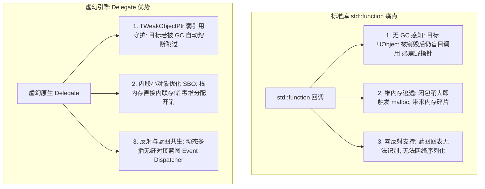
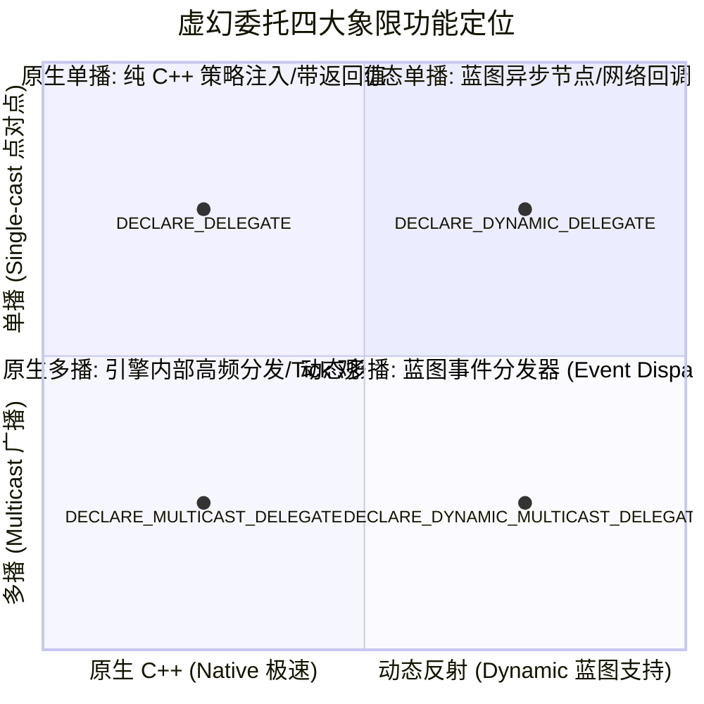
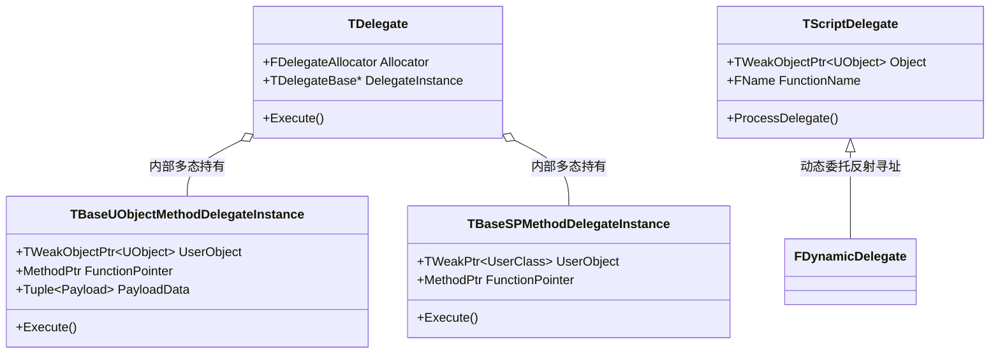

## 前言：解耦与响应式架构的中枢神经

在复杂的现代游戏引擎中，模块间的通信与解耦一直是软件工程的终极课题：
- 玩家受到攻击扣血，UI 界面血条需要实时更新；
- 怪物被击杀，成就系统、任务系统、掉落系统需要同步捕获该事件；
- 动画播放到特定帧，通过动画通知（AnimNotify）触发脚步声、播放地面尘土粒子特效。

如果采用传统的强引用直接调用（如让 `ACharacter` 直接持有 `UUserWidget*`、`UQuestManager*`、`UAchievementSystem*`），整个代码库将迅速演化为盘根错节、牵一发而动全身的“面条代码”，模块复用与单元测试也将沦为空谈。

为了解决这一痛点，虚幻引擎（Unreal Engine）构筑了一套兼顾**原生 C++ 极致性能、多线程类型安全、UObject 垃圾回收感知、以及蓝图可视化交互**的工业级回调基石——**委托系统（Delegates）**。

在前面四篇专题中，我们系统剖析了 [UHT 前端编译](/posts/ue5-uht-generated-code-deep-dive)、[运行时元数据与 FProperty](/posts/ue5-runtime-uobject-reflection-system)、[类默认对象 CDO](/posts/ue5-cdo-architecture-deep-dive) 以及 [垃圾回收 GC 系统](/posts/ue5-gc-garbage-collection-deep-dive)。今天这篇专题，我们将直击委托系统的底层腹地，彻底拆解四大委托的内存拓扑、弱引用安全屏障以及 3A 级避坑实战。

---

## 一、为什么不用 `std::function`？虚幻委托的设计哲学

很多 C++ 开发者初入虚幻时常有疑问：“C++11 标准库已经有了 `std::function`，虚幻为什么还要造轮子？”

虚幻引擎摒弃 `std::function` 的背后，有着极其深刻的性能与工程考量：



| 维度对比 | `std::function` | 虚幻引擎委托（UE Delegates） |
| :--- | :--- | :--- |
| **GC 对象感知** | ❌ 无感知。绑定的 `UObject*` 一旦被 GC 回收，调用时立即触发野指针崩溃 | ✅ **全自动感知**。内部以 `TWeakObjectPtr` 维护生命周期，目标消亡自动安全熔断 |
| **内存分配** | ⚠️ 小对象优化阈值小，易触发堆内存分配（Heap Allocation）造成内存碎片 | ✅ **专有内存对齐分配器**（Inline Allocator），常规函数对象零堆内存分配 |
| **蓝图交互** | ❌ 纯 C++ 机制，蓝图无法暴露、绑定或序列化 | ✅ **动态委托无缝对接蓝图**，支持事件分发器（Event Dispatcher）拖拽拉线 |
| **多播广播** | ❌ 原生不支持，需手动管理函数指针容器并处理并发增删 | ✅ **原生支持多播（Multicast）**，自带句柄（`FDelegateHandle`）安全增删 |

---

## 二、四大委托类型全景谱系与拓扑

虚幻引擎将委托划分为两大正交维度：**【单播 vs 多播】** 与 **【原生 C++ vs 动态反射（Dynamic）】**，由此构成了清晰的四象限矩阵：



---

### 1. 原生单播委托（Native Single-cast Delegate）

- **核心宏：** `DECLARE_DELEGATE(...)`、`DECLARE_DELEGATE_RetVal(...)`；
- **核心能力：** **有且仅能绑定一个回调目标**，**唯一支持返回值的委托类型**；
- **典型应用：** 策略模式注入、状态机条件检查函数、带计算结果的同步请求。

```cpp
// 声明一个：接收 float 参数，返回 bool 结果的单播委托
DECLARE_DELEGATE_RetVal_OneParam(bool, FCheckCanAttackDelegate, float /* AttackRange */);

class FPlayerCombatModule
{
public:
    FCheckCanAttackDelegate CanAttackChecker;

    bool TryExecuteAttack(float Range)
    {
        // 安全调用：如果已绑定则执行，否则走默认逻辑
        if (CanAttackChecker.IsBound())
        {
            return CanAttackChecker.Execute(Range);
        }
        return false;
    }
};
```

---

### 2. 原生多播委托（Native Multi-cast Delegate）

- **核心宏：** `DECLARE_MULTICAST_DELEGATE(...)`；
- **核心能力：** 支持通过 `Add...()` 挂接**任意数量的监听者**；触发时通过 `Broadcast()` 依序通知全员；**禁止定义返回值**；
- **性能特征：** 纯原生 C++ 实现，调用速度极快，适合引擎底层或每帧高频广播。

```cpp
// 声明一个怪物受到伤害的多播委托
DECLARE_MULTICAST_DELEGATE_TwoParams(FOnMonsterDamaged, float /* Damage */, AActor* /* DamageCauser */);

class AMonsterCharacter : public ACharacter
{
public:
    FOnMonsterDamaged OnDamagedEvent;

    void TakeDamageLogic(float Damage, AActor* Causer)
    {
        // 广播给所有监听者 (UI血条、伤害飘字、AI仇恨组件)
        OnDamagedEvent.Broadcast(Damage, Causer);
    }
};
```

---

### 3. 动态单播委托（Dynamic Single-cast Delegate）

- **核心宏：** `DECLARE_DYNAMIC_DELEGATE(...)`；
- **核心能力：** 借助反射系统注册，**目标函数必须带有 `UFUNCTION()`**；支持作为 `UPROPERTY()` 暴露给蓝图作为函数引脚传递。
- **典型应用：** UMG 控件的属性绑定（Property Binding）、自定义异步蓝图节点（Blueprint Async Actions）。

---

### 4. 动态多播委托（Dynamic Multi-cast Delegate）

- **核心宏：** `DECLARE_DYNAMIC_MULTICAST_DELEGATE(...)`；
- **神级地位：** 这正是虚幻编辑器中广为人知的**蓝图事件分发器（Event Dispatcher）**在 C++ 层的物理本质！
- **修饰契约：** 必须使用 `UPROPERTY(BlueprintAssignable)` 修饰，方可在蓝图视口拉出 `Assign`、`Bind`、`Unbind`、`Event` 节点。

```cpp
// 1. 声明动态多播宏 (参数名在宏中不可省略，因为 UHT 需要生成蓝图形参名称)
DECLARE_DYNAMIC_MULTICAST_DELEGATE_TwoParams(FOnHealthChangedSignature, float, CurrentHealth, float, MaxHealth);

UCLASS()
class AMyPlayerCharacter : public ACharacter
{
    GENERATED_BODY()

public:
    // 2. 暴露给蓝图拉线监听
    UPROPERTY(BlueprintAssignable, Category = "Combat|Events")
    FOnHealthChangedSignature OnHealthChanged;

    void ApplyHealing(float HealAmount)
    {
        CurrentHealth = FMath::Clamp(CurrentHealth + HealAmount, 0.0f, MaxHealth);
        
        // 3. 广播分发
        OnHealthChanged.Broadcast(CurrentHealth, MaxHealth);
    }
};
```

---

## 三、委托底层内存模型与绑定方式全景拆解

虚幻委托之所以能将普通全局函数、Lambda 表达式、`TSharedPtr` 以及 `UObject*` 统摄在同一种抽象接口下，归功于其底层精密的**代理多态包装器（Delegate Instance）**设计。



---

### 1. 原生委托的 6 大绑定方式与生命周期守护

原生委托（单播或多播）提供了极其丰富细致的绑定入口，每种入口对应完全不同的生命周期安全机制：

| 绑定 API | 适用对象类型 | 生命周期安全机制 | 危险等级 |
| :--- | :--- | :--- | :--- |
| **`BindUObject` / `AddUObject`** | 继承自 `UObject` 的类 | **强弱混血防护**：内部存储 `TWeakObjectPtr`，执行前检测 `IsValid()` | 🟢 极度安全（首选） |
| **`BindSP` / `AddSP`** | 原生 C++ 类（被 `TSharedPtr` 托管） | 存储 `TWeakPtr`，执行前自动 `Pin()` 提升，对象消亡则跳过 | 🟢 极度安全 |
| **`BindRaw` / `AddRaw`** | 原生 C++ 裸指针（无智能指针） | **零保护**！纯原生裸指针，对象销毁后触发未定义崩溃 | 🔴 极高危险 |
| **`BindStatic` / `AddStatic`** | 全局静态函数 / 类静态成员函数 | 生命周期伴随程序全局，无需考虑对象消亡 | 🟢 绝对安全 |
| **`BindLambda` / `AddLambda`** | C++ 匿名闭包（Lambda） | 取决于闭包捕获方式！**值捕获安全，裸引用捕获危险** | 🟡 需谨慎使用 |
| **`BindThreadSafeSP`** | 跨线程智能指针（`ESPMode::ThreadSafe`） | 线程安全弱指针提升，防止多线程并发析构竞争 | 🟢 跨线程首选 |

#### 源码真相：`BindUObject` 是如何防范野指针的？
来看引擎底层 `TBaseUObjectMethodDelegateInstance` 的执行逻辑伪代码：

```cpp
bool Execute(ParamTypes... Params) const override
{
    // 1. 检查内部保存的弱指针是否依然健康有效
    if (UserObject.IsValid())
    {
        // 2. 确认对象未处于 PendingKill 或 Garbage 标记状态
        const UObject* RawObject = UserObject.Get();
        
        // 3. 安全地通过函数指针直接调用 C++ 原生方法！
        return (RawObject->*MethodPtr)(Params..., Payload...);
    }
    
    // 4. 对象已经被 GC 回收！自动静默熔断，绝不访问已释放内存！
    return false;
}
```

---

### 2. 动态委托的本质：名字与反射调用的纽带

动态委托（`TScriptDelegate` / `FMulticastScriptDelegate`）的结构比原生委托要纯粹得多：
它在内存中甚至**不保存任何 C++ 虚表或函数指针**！

打开引擎源码，它的核心成员只有区区两个：
```cpp
// ScriptDelegate.h
class FScriptDelegate
{
    TWeakObjectPtr<UObject> Object; // 目标对象弱引用
    FName FunctionName;             // 目标 UFUNCTION 的名字哈希
};
```

#### 为什么 `AddDynamic` 必须包一层宏？
在 C++ 中我们通常这样绑定：
```cpp
MyComp->OnDamaged.AddDynamic(this, &AMyCharacter::OnTakeDamage);
```
很多人以为第二个参数传的是函数指针。
其实查看宏展开：
```cpp
#define AddDynamic(UserObject, FuncName) \
    __Internal_AddDynamic(UserObject, FuncName, STATIC_FUNCTION_FNAME(TEXT(#FuncName)))
```
**真相是：** 该宏通过预处理器 `#FuncName` 把你的函数指针名字，变成了字符串反射哈希 `FName(TEXT("OnTakeDamage"))`！  
在真正触发 `Broadcast` 时，底层通过目标对象的反射表 `FindFunctionChecked` 找到对应的 `UFunction*`，最终调用 `ProcessEvent` 完成跨语言派发！

---

## 四、高级进阶：内联小对象优化（SBO）与预置有效载荷（Payload）

---

### 1. 内联小对象优化（Small Buffer Optimization, SBO）

频繁分配委托实例（例如在各种事件间传递委托）如果每次都调用全局堆内存管理器（`malloc` / `FMemory::Malloc`），会产生严重的内存碎片。

虚幻委托实现了一套 **Inline Allocator**：
- 在 `TDelegate` 内部预留了固定字节（通常为 32 字节）的内联栈空间；
- 如果你绑定的成员函数指针和捕获数据较小，委托实例直接就地存储在栈上，**完全零堆分配开销**；
- 只有当你通过 Lambda 捕获了超大结构体（超过内联上限）时，才会动态退化为堆内存分配。

---

### 2. 绑定期预置实参（Payload / Currying）

虚幻委托支持在**绑定时刻（Bind/Add）预置附带实参**，而在触发时刻（Execute/Broadcast）只需传递剩余的动态参数。这在实现通用回调时具有极强的表现力：

```cpp
DECLARE_MULTICAST_DELEGATE_OneParam(FOnInventoryUpdated, int32 /* SlotIndex */);

class UUIInventoryBar : public UUserWidget
{
    void BindSlots()
    {
        for (int32 SlotIdx = 0; SlotIdx < 8; ++SlotIdx)
        {
            // 在绑定期将 SlotIdx 作为固定 Payload 传入！
            // 目标函数甚至可以声明为接收两个参数：(int32 SlotIndex, FString SlotCategory)
            InventoryComp->OnUpdated.AddUObject(
                this, 
                &UUIInventoryBar::OnSlotRefreshed, 
                SlotIdx,                // 预置 Payload 1
                FString("Equip")        // 预置 Payload 2
            );
        }
    }

    void OnSlotRefreshed(int32 SlotIndex, FString SlotCategory)
    {
        // 动态广播时甚至不需要知道 SlotCategory，绑定时已注定！
    }
};
```

---

## 五、Events（事件）与委托的封装博弈

在虚幻引擎中，除了 `DECLARE_MULTICAST_DELEGATE`，你经常还会看到：
```cpp
DECLARE_EVENT_OneParam(AMyWeapon, FOnAmmoChangedEvent, int32);
```

#### 为什么有了多播委托，还要单独设计一个 `EVENT`？
**答案：为了严格捍卫面向对象架构的“封装性（Encapsulation）”。**

- **常规多播委托的问题：**  
  如果一个类公开了一个 `FOnDamagedMulticast OnDamaged;`，外部任何拿到指针的模块不仅可以 `Add` 监听，甚至可以随意调用 `OnDamaged.Broadcast()`（冒充武器开火）或 `OnDamaged.Clear()`（把别人的监听全部清空！）；
- **`DECLARE_EVENT` 的保护铁壁：**  
  事件必须指定声明者类型（如 `DECLARE_EVENT_OneParam(AMyWeapon, ...)`）。  
  引擎在编译期限制：**只有作为所有者的 `AMyWeapon` 类内部，有权调用 `Broadcast()` 与 `Clear()`；外部任何类只能访问 `Add()` 和 `Remove()`！**

---

## 六、3A 级工程避坑指南与高危反模式

---

### 1. 致命天坑：动态委托绑定了非 UFUNCTION 函数

```cpp
class AMyPlayer : public ACharacter
{
    // ❌ 灾难隐患：漏写了 UFUNCTION() 宏！
    void OnCombatStateChanged(int32 NewState);

    void Setup()
    {
        // 💥 编译通过，但运行时完全失效或直接报错！
        CombatComp->OnStateChangedDynamic.AddDynamic(this, &AMyPlayer::OnCombatStateChanged);
    }
};
```

#### 为什么会静默失效？
前文已经揭秘，动态委托底层是通过反射哈希 `FName("OnCombatStateChanged")` 去类的反射表中检索 `UFunction*`。  
由于你漏写了 `UFUNCTION()`，UHT 不会为该函数生成反射元数据，`FindFunction` 返回 `nullptr`，广播时彻底哑火！

---

### 2. 悬挂野指针：AddLambda 隐式值捕获与引用捕获

```cpp
void AMySpawner::SpawnWave()
{
    AActor* TemporaryTarget = GetTarget();

    // ❌ 极度危险：闭包捕获了裸指针 TemporaryTarget
    GetWorldTimerManager().SetTimer(TimerHandle, [TemporaryTarget]()
    {
        // 💥 如果在 Timer 倒计时期间，TemporaryTarget 已经被打死并被 GC 销毁，
        // 此处的 TemporaryTarget 沦为危险野指针，立即崩溃！
        TemporaryTarget->SetActorLocation(FVector::ZeroVector);
    }, 5.0f, false);
}
```

```cpp
// ✅ 安全范式：捕获弱指针并在执行前检验
TWeakObjectPtr<AActor> WeakTarget = GetTarget();
GetWorldTimerManager().SetTimer(TimerHandle, [WeakTarget]()
{
    if (WeakTarget.IsValid())
    {
        WeakTarget->SetActorLocation(FVector::ZeroVector);
    }
}, 5.0f, false);
```

---

### 3. 多播遍历中的“自残陷阱”（Concurrent Modification）

想象一个场景：在广播执行期间，某个监听者在自己的回调函数内部，直接调用了 `OnDeath.Remove(MyHandle)` 甚至 `OnDeath.Clear()`。

#### 引擎内部的防重入机制：
虚幻多播委托底层在调用 `Broadcast()` 时，为了防止容器在遍历过程中发生内存重分配（Reallocation Crash），内部维系了**调用锁（Invocation Lock）**：
- 在广播过程中发生 `Remove`，委托并不会立刻将该元素从数组中抹除并紧缩内存；
- 而是将其标记为一个“墓碑状态（Tombstone / Deferred Removal）”，直到本次广播完全退栈后，才统一进行内存压实整理。

---

### 4. 性能调优：千万别在 120 FPS 的 Tick 循环中滥用动态多播

| 委托类型 | 调用机制 | 单次调用开销 | 适用频率 |
| :--- | :--- | :--- | :--- |
| **原生单播 / 多播** | 直接函数指针跳转 / 内联执行 | **纳秒级（1~5 ns）** | 极高频（每帧 Tick、物理模拟、高频粒子） |
| **动态委托 / 蓝图分发器** | 反射检索、参数打包、`ProcessEvent` | **微秒级（0.2~2 µs）** | 低中频（状态变更、UI 切换、Gameplay 事件） |

> 📌 **选型定律：**
> - 纯 C++ 内部核心模块间的通信，**一律使用原生委托（`DECLARE_MULTICAST_DELEGATE`）**；
> - 只有需要暴露给策划在蓝图里拖线、或者需要网络序列化的事件，才使用动态多播（`DECLARE_DYNAMIC_MULTICAST_DELEGATE`）。

---

## 七、全景速查对照表与核心记忆法则

| 委托宏声明 | 绑定支持能力 | 返回值 | 蓝图支持 | 底层实现核心 |
| :--- | :--- | :--- | :--- | :--- |
| **`DECLARE_DELEGATE`** | 原生单播（1个） | ✅ **支持** | ❌ 纯 C++ | `TDelegate`，内存小对象内联 |
| **`DECLARE_MULTICAST_DELEGATE`** | 原生多播（N个） | ❌ 不支持 | ❌ 纯 C++ | `TMulticastDelegate`，句柄增删安全 |
| **`DECLARE_EVENT`** | 封装版原生多播 | ❌ 不支持 | ❌ 纯 C++ | 仅声明类有权 `Broadcast` / `Clear` |
| **`DECLARE_DYNAMIC_DELEGATE`** | 反射单播（1个） | ✅ 支持 | ✅ 可作为蓝图参数 | `TScriptDelegate`，基于 `UFunction` |
| **`DECLARE_DYNAMIC_MULTICAST_DELEGATE`** | 反射多播（N个） | ❌ 不支持 | ✅ **蓝图事件分发器** | `FMulticastScriptDelegate`，`ProcessEvent` |

### 核心记忆口诀：
- **解耦先锋选委托**：点对点注入用单播，广而告之用多播；
- **动态反射通蓝图**：蓝图拉线 Dynamic，`UFUNCTION` 缺一不可行；
- **生命安全牢记心**：`BindUObject` 弱指针守门，原生裸绑（Raw）祸患生！
