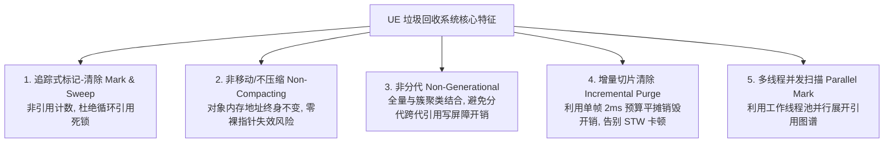
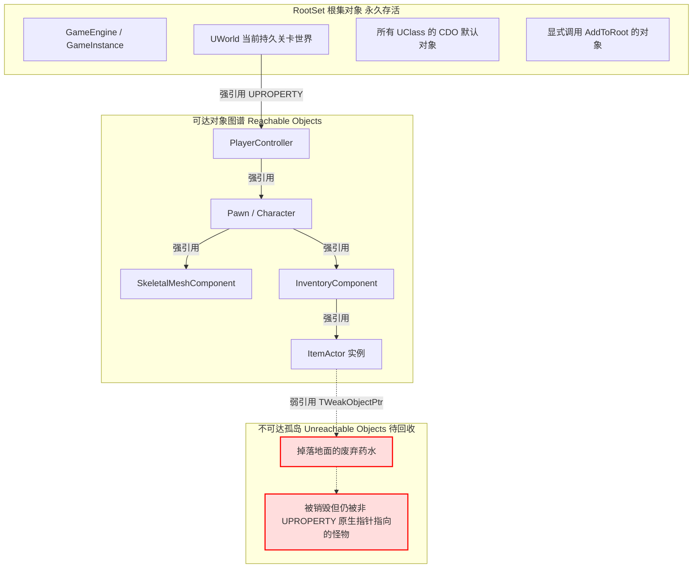
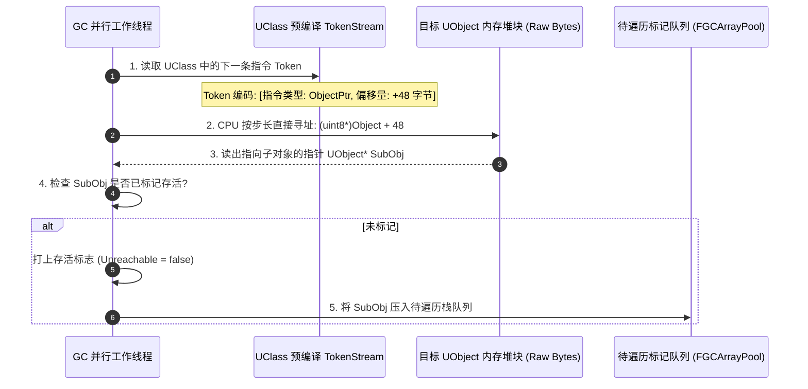
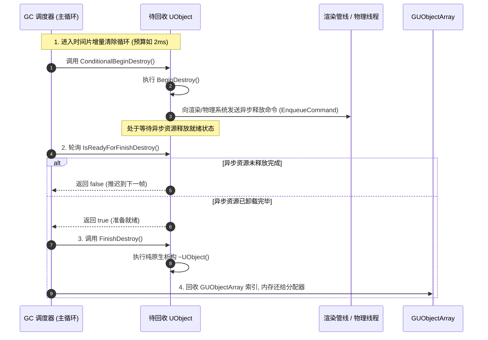
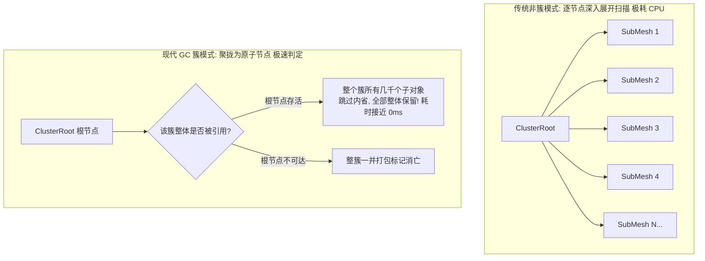

## 前言：C++ 手动管理与全自动回收的交响乐

在主流游戏引擎的设计中，内存管理策略往往呈现两种极端：
- **纯原生 C++ 手动管理：** 极速、确定性高，但开发者每天都在与野指针（Wild Pointer）、悬挂指针（Dangling Pointer）以及内存泄漏（Memory Leak）进行无休止的搏斗；
- **全托管语言（如 C# / Java）分代回收：** 内存安全，但垃圾回收（GC）触发时的偶发性全局停顿（Stop-the-World STW）会引发严重的掉帧与卡顿（Stuttering），令追求毫秒级响应的 3A 动作与射击游戏痛心疾首。

虚幻引擎（Unreal Engine）走出了一条极富工业哲学的**“第三条道路”**：
- **底层依然是高性能、确定性的纯 C++ 内存布局**；
- 依托前面三篇解析的 [UHT 代码生成](/posts/ue5-uht-generated-code-deep-dive)、[运行时 UClass/FProperty 反射体系](/posts/ue5-runtime-uobject-reflection-system) 与 [CDO 模板架构](/posts/ue5-cdo-architecture-deep-dive)，为 `UObject` 体系构建了一套**非侵入、非分代、不压缩内存的追踪式标记-清除（Mark & Sweep）垃圾回收系统**。

今天这篇文章，我们将直击虚幻 GC 的引擎源码实现，全面回答：
1. **虚幻 GC 的根集（RootSet）到底由谁构成？引擎是如何判断一个对象“已死”的？**
2. **为什么虚幻 GC 扫描成千上万个对象却不需要频繁调用虚函数？`FGCReferenceTokenStream` 字节码是如何加速寻址的？**
3. **主线程掉帧卡顿克星：时间片增量清除（Incremental Purge）与 GC 簇（Cluster）是怎样做平滑优化的？**
4. **野指针、弱引用失效、原生非 UObject 类持有 `UObject*` 导致的内存泄漏，该如何规范规避？**

---

## 一、虚幻 GC 的核心设计哲学与技术特征

在展开源码之前，我们必须先理清虚幻 GC 区别于传统托管虚拟机（CLR / JVM）的五大核心技术特征：



| 架构维度 | 虚幻引擎 GC 策略 | 设计意图与工程权衡 |
| :--- | :--- | :--- |
| **基础算法** | **追踪式标记-清除（Mark & Sweep）** | 从根集出发沿引用图展开遍历。天然解决 $A \rightarrow B \rightarrow A$ 循环引用无法释放的问题。 |
| **内存压缩** | **不移动内存（Non-Compacting）** | 对象的指针在生命周期内永不漂移，原生 C++ 指针可安全传递，无需指针重定向开销。 |
| **内存分代** | **非分代（Non-Generational）** | 不区分新生代与老年代，无需昂贵的写屏障（Write Barrier）拦截属性赋值。 |
| **清除执行** | **时间片增量清除（Incremental Purge）** | 将成千上万个废弃对象的析构平摊到每一帧末尾（默认预算如 2ms），平滑帧率。 |
| **引用载体** | **依托反射与 `UPROPERTY`** | 仅被 `UPROPERTY` 标记或通过 `AddReferencedObjects` 注册的强引用才被计入可达图谱。 |

---

## 二、第一阶段：谁是根集？（RootSet 与可达性识别）

任何标记清除算法的第一步，都是确定**“世界树的根（Root Set）”**。如果一个对象在根集直接或间接的引用链路上，它就是**可达的（Reachable）**；否则即判定为死对象，静候收割。



---

### 1. 虚幻中的根集成员（Root Set）都包含谁？

在全局对象池 `GUObjectArray` 中，每个对象对应一个 `FUObjectItem`。当一个对象属于根集时，其标志位会打上：
`EInternalObjectFlags::RootSet`。

主要常驻根集包括：
1. **类默认对象（CDO）：** 所有反射类型的 `ClassDefaultObject` 在创建时就被强制打上 `RootSet`，永不卸载；
2. **核心单例系统：** `GEngine`、`UGameInstance`、全局子系统（`USubsystem`）；
3. **活动的世界网络：** 当前加载的主世界 `UWorld`、`AGameModeBase`、活跃关卡（`ULevel`）；
4. **开发者手动加锁对象：** 显式调用了 `MyObject->AddToRoot()` 的实例。

---

### 2. 强引用 vs 弱引用在 GC 眼中的本质差别

```cpp
UCLASS()
class APlayerCharacter : public ACharacter
{
    GENERATED_BODY()

    // ✅ 强引用：GC 沿着此路径标记，TargetGun 永远不可被回收
    UPROPERTY()
    TObjectPtr<AWeaponActor> TargetGun;

    // ❌ 裸指针：未被反射系统追踪，GC 对其完全“失明”！
    // 一旦 TargetGun2 在别处销毁，此处沦为危险的悬挂野指针！
    AWeaponActor* TargetGun2;

    // 💡 弱引用：不增加可达引用计数，目标被回收后自动置空（IsValid() 返回 false）
    TWeakObjectPtr<AEnemyCharacter> LockedEnemy;
};
```

- **`UPROPERTY()` 强引用：** 将变量信息编译进 `UClass` 的反射链表中，GC 在展开遍历时会将其视为合法的引申边；
- **原生裸指针（Raw C++ Pointer）：** 编译器原生内存，GC 扫描时直接跳过！目标对象一旦因别处无引用被回收，该原生指针仍然存储着旧内存地址，访问即崩；
- **`TWeakObjectPtr`：** 内部通过 `FUObjectItem` 的 `SerialNumber`（序列号）与对象索引机制做校验。它**不阻止对象被垃圾回收**；当对象被回收后，它的弱引用检测会自动失效，杜绝悬挂指针。

---

## 三、第二阶段：极速标记——FGCReferenceTokenStream 字节码黑魔法

在大型开放世界项目中，场景中的 `UObject` 数量可能高达数十万甚至数百万。
如果 GC 遍历每一个对象时，都要调用一次虚函数、或者通过 C++ RTTI 做动态类型分支判定，CPU 的 L1/L2 缓存将被反复击穿，帧率直接归零。

虚幻在这里祭出了一项工业级优化：**二进制字节码指令流（Reference Token Stream）**。



### 1. 为什么不用虚函数 `AddReferencedObjects`？

在旧版虚幻或常规面向对象实现中，基类通常暴露一个虚函数：
```cpp
virtual void AddReferencedObjects(FReferenceCollector& Collector);
```
然后每个子类覆写它，把自己的成员指针喂给收集器。

**性能灾难：**  
遍历几十万个对象意味着**几十万次虚表指针寻址（VTable Jump）**，伴随大量的流水线气泡（Pipeline Bubble）与 CPU 缓存未命中（Cache Miss）。

### 2. TokenStream 字节码的编译与执行

在[第二篇：UClass 启动装载生命周期](/posts/ue5-runtime-uobject-reflection-system)中，我们讲到 `UStruct::Link()` 会计算所有属性的内存绝对偏移。此时，引擎会顺手为每个 `UClass` 编译出一串高度紧凑的二进制指令集——**`FGCReferenceTokenStream`**：

```
[Token 0]: SkipTo(Offset = 32)
[Token 1]: ReadObjectPointer(Type = SingleObject, Offset = +32)
[Token 2]: ReadTArrayObjects(Offset = +48, ElementStride = 8)
[Token 3]: EndOfStream
```

#### 执行优势
- GC 标记线程在扫描一个对象时，直接调用紧凑的循环解析器；
- 没有虚函数调用，CPU 指令分支预测准确率接近 100%；
- 像解释器执行汇编一样，按字节偏移直接去实例内存抓出子对象指针，迅速压入标记工作栈。

---

## 四、第三阶段：增量清除流水线（Incremental Purge）

当标记阶段（Mark Phase）完成后，所有存活对象的 `Unreachable` 标志位被剔除。
剩下的那些孤立对象，就是必须被消灭的“垃圾”。

但一次性析构数万个对象，会产生巨大的卡顿。虚幻如何解决？
答案是：**异步化 + 时间片切片（Time-Sliced Incremental Purge）**。



---

### 1. 时间片平摊：告别瞬时卡顿

虚幻引擎通过控制台变量限制每帧用于垃圾清除的毫秒上限：
- **`gc.IncrementalPurgeBudget`（默认通常为 0.002s 即 2ms）：**  
  在主线程每帧末尾的 `Tick` 中，GC 遍历待清除列表。如果本帧耗时达到了 2ms，立即**暂停当前销毁，保存游标，下一帧继续收割**！
- 这保证了哪怕有一万个 Actor 被批量销毁，也不会在一个单帧内产生几十毫秒的严重抽搐。

---

### 2. 两阶段销毁：BeginDestroy 到 FinishDestroy

虚幻的对象销毁不是简单的 `delete ptr`，因为许多对象持有跨线程资源（如 GPU 纹理显存、物理碰撞体）：

1. **`BeginDestroy()`（发起异步解绑）：**  
   在主线程调用。对象在此通知渲染线程释放相关 RHI 资源、通知 PhysX/Chaos 移除刚体物理；
2. **`IsReadyForFinishDestroy()`（栅栏等待）：**  
   引擎轮询此函数。只有当渲染线程回传确认“显存资源已安全解绑”，才放行后续流程，避免多线程内存并发访问崩溃；
3. **`FinishDestroy()`（真身离场）：**  
   调用 C++ 析构函数，释放纯 CPU 内存，并回收全局索引。

---

## 五、工业级吞吐优化：GC 簇（GC Clusters）

如果一个关卡里加载了一个包含几千棵树木的 Prefab（或者一个由几千个粒子组成的特效组件集合），GC 每一次扫描都要逐个遍历这几千个子节点，开销依旧不菲。

为此，虚幻引擎引入了 **GC 簇（GC Clusters，对象聚簇）** 机制。



- **核心思想：**  
  将具有强从属关系的父子对象（例如 `UMaterialInstance` 与其关联的资源、粒子系统与组件）打上 `RF_ClusterRoot`，聚拢成一个“原子整体”；
- **扫描跳跃：**  
  在 GC 标记阶段，只要检测到该簇的 Root 节点存活，**引擎不再逐一展开深入扫描该簇内部的成百上千个子对象，而是直接将整簇整体豁免**！
- **收益：** 将复杂资产引用的标记扫描时间缩短了 50%~80%。

---

## 六、3A 级开发避坑指南与高危反模式

---

### 1. 天坑之首：原生 C++ 结构体/类持有 UObject 指针导致被静默回收

#### 场景复现
很多团队喜欢使用纯 C++ 架构写一些 Manager 或数据仓库（非 `UObject` 体系）：

```cpp
// ❌ 灾难代码：纯原生 C++ 类持有 UObject 指针
class FCombatRewardManager
{
public:
    // 💥 致命隐患！虽然写了指针，但因为它不是 UObject，
    // UPROPERTY 根本不生效！GC 对该引用完全“失明”！
    TArray<UItemAsset*> CachedItems;
};
```

#### 恶果
当外部没有其他地方强引用 `CachedItems` 中的道具时，虚幻 GC 会直接认定这些道具无人使用，将其**无情销毁并清空内存**！当你在原生管理器中访问它们时，直接触发野指针内存非法访问崩溃。

#### 正确解法：继承 `FGCObject` 接口
如果一个纯原生 C++ 类必须持有 `UObject*` 强指针，必须派生自 **`FGCObject`** 并重写注册函数：

```cpp
// ✅ 正确范式：通过 FGCObject 向引擎报备
class FCombatRewardManager : public FGCObject
{
public:
    TArray<TObjectPtr<UItemAsset>> CachedItems;

    // 关键守护：当引擎 GC 展开根集时，会主动调用该函数！
    virtual void AddReferencedObjects(FReferenceCollector& Collector) override
    {
        Collector.AddReferencedObjects(CachedItems);
    }

    // 用于性能分析与内存调试的标识名称
    virtual FString GetReferencerName() const override
    {
        return TEXT("FCombatRewardManager");
    }
};
```

---

### 2. 内存泄漏死锁：忘了调用 `RemoveFromRoot()`

```cpp
// ⚠️ 高危代码：随意加锁却不解锁
void UMyAssetLoader::PinAsset(UObject* InAsset)
{
    if (InAsset)
    {
        InAsset->AddToRoot(); // 该资产进入永生状态，哪怕切关、关卡卸载也绝不释放！
    }
}
```

- `AddToRoot()` 的本质是赋予该对象 `EInternalObjectFlags::RootSet`；
- 一旦开发者因为状态机异常、异常中断分支忘记调用成对的 `InAsset->RemoveFromRoot()`，**该对象及由它强引用的整张对象子树将永久驻留内存**，引发严重的内存泄漏，直到游戏进程退出！
- **建议：** 尽量依靠 Gameplay 架构（如挂载在 `GameInstance` 或拥有者 Actor 身上）保持生命周期，避免滥用 `AddToRoot()`。

---

### 3. UE5 新规范：淘汰 `PendingKill`，全面拥抱 `IsValid`

在 UE4 时代，我们经常在代码里看到：
`MarkPendingKill()` 以及 `TargetActor->IsPendingKill()`。

在 **UE5** 中，Epic 对对象生命周期状态进行了统一收拢：
- `PendingKill` 概念被正式废弃，统一并入 `EInternalObjectFlags::Garbage`；
- 所有判断对象是否存活、是否已被标记消亡的代码，**统一使用 `IsValid(Obj)` 或智能指针 `IsValidChecked()`**：

```cpp
// ✅ 现代 UE5 安全判空范式
if (IsValid(MyTargetActor))
{
    MyTargetActor->DoSomething();
}
```

---

## 七、全景速查对照表与核心记忆法则

| 概念 / API | 作用与生命周期影响 | 典型应用与注意事项 |
| :--- | :--- | :--- |
| **`UPROPERTY()`** | 标记反射强引用，GC 自动识别可达路径 | 任何挂在 `UObject` 内部的指针必须使用，防止被误回收 |
| **`TWeakObjectPtr<T>`** | 弱引用，不增加可达权重 | 目标被回收后自动置空，适用于观察者、UI 目标指向 |
| **`TSoftObjectPtr<T>`** | 软对象路径弱引用 | 支持异步加载资产（`RequestAsyncLoad`），按需换入换出 |
| **`FGCObject`** | 原生非 UObject C++ 类保护 UObject 的桥梁 | 必须实现 `AddReferencedObjects` 显式喂给收集器 |
| **`AddToRoot()` / `RemoveFromRoot()`** | 强行将对象纳入/移出常驻根集 | 必须成对使用，严防切关泄漏 |
| **`gc.IncrementalPurgeBudget`** | 控制单帧垃圾清除的 CPU 时间片（秒） | 默认约 `0.002`（2ms），根据平台帧率目标微调 |

### 核心记忆口诀：
- **可达即存活**：根集牵线保平安，`UPROPERTY` 构筑生命链；
- **原生类防失明**：纯 C++ 莫大意，`FGCObject` 需承继；
- **增量切片平卡顿**：两毫秒内清垃圾，`BeginDestroy` 待显存；
- **慎用 Root 防死锁**：若非万不得已加根集，用罢切记速放行！
