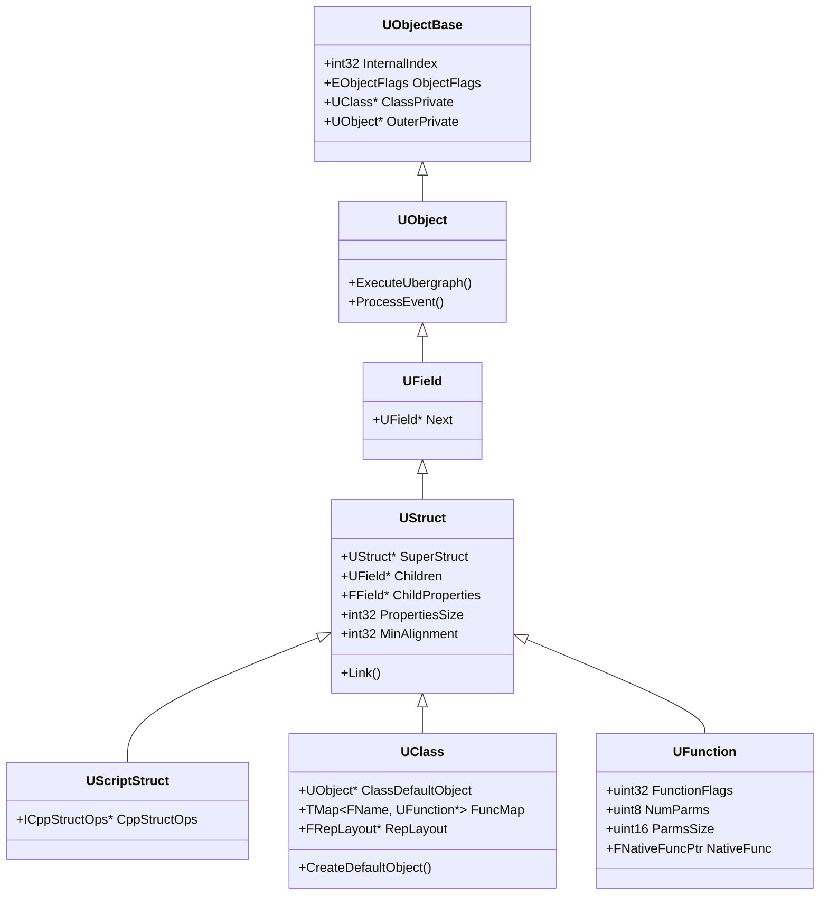
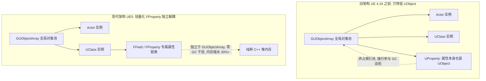
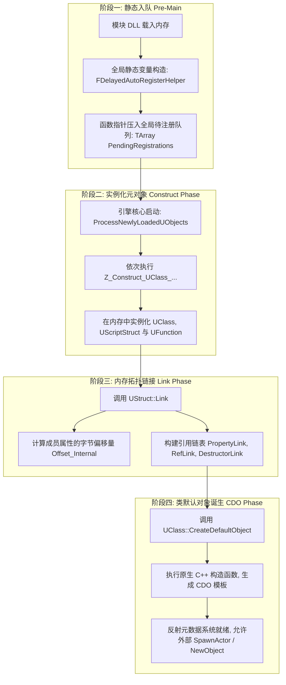
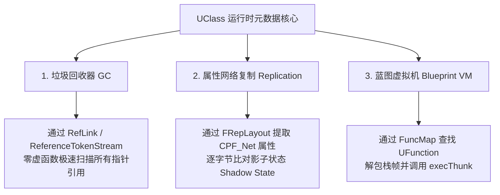
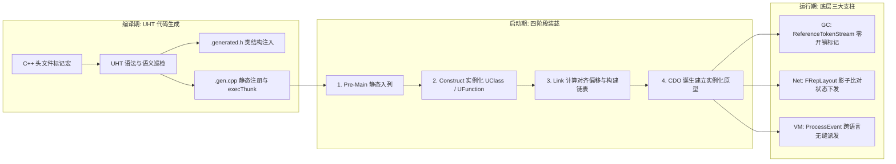

## 前言：从静态生成的元数据，到生机勃勃的运行时世界

在[上篇《UHT 运作机制与 generated.h / gen.cpp 源码解密》](/posts/ue5-uht-generated-code-deep-dive)中，我们揭开了虚幻头文件工具（UHT）在预编译期所做的工作：它扫描代码中的反射宏，自动生成了 `.generated.h`（类体插槽注入）以及 `.gen.cpp`（静态元数据注册机）。

然而，代码生成仅仅是铺好了“铁轨”。
当游戏引擎正式启动、模块 DLL 载入内存时：
- **这些在 `.gen.cpp` 中生成的静态函数是如何被引擎唤醒的？**
- **内存中的 `UClass`、`UField`、`UFunction` 和属性对象到底是以怎样的结构相互交织的？**
- **为什么虚幻在 4.25+ 痛下决心推翻重构，把传统的 `UProperty` 废弃并重写为非 UObject 的 `FProperty`？**
- **一个由 C++ 编写的对象，是如何仅仅依靠这些元数据，就能被虚幻的垃圾回收器（GC）扫描、被网络驱动器自动同步、并被蓝图解释器动态调用的？**

今天这篇下篇指南，我们将直击虚幻引擎运行时的内存腹地，全面拆解**运行时元数据对象系统的架构拓扑与生命周期**。

---

## 一、运行时反射系统的核心拓扑体系

在虚幻引擎中，**“描述类型的数据本身，也是对象”**。
为了表达复杂的 C++ 类型、继承关系、函数签名和成员变量，虚幻构建了一套森严的元对象（Meta Objects）继承链：



---

### 1. UField 与 UStruct：结构化复合类型的基石

- **`UField`：** 虚幻中所有可反射命名符号的抽象基类。它内部包含一个关键指针 `UField* Next`，这意味着挂载在同一个所有者下的字段是以**单向链表**的形式串联起来的；
- **`UStruct`：** 继承自 `UField`，但它绝不仅指 C++ 的 `struct`，而是指**所有包含内存成员变量与子符号的复合内存结构**：
  - `UScriptStruct`（纯结构体，对应 `USTRUCT`）；
  - `UClass`（包含方法、虚表与 CDO 的类，对应 `UCLASS`）；
  - `UFunction`（包含局部实参、返回值参数列表的函数，对应 `UFUNCTION`）。

在 `UStruct` 内部，维护了极其关键的内存元数据字段：
```cpp
// 核心父类指针，构成了类型的单继承继承树
UStruct* SuperStruct;

// 挂载的所有 UField 子项链表头指针（如内部函数）
UField* Children;

// 挂载的所有 FProperty 成员属性链表头指针
FField* ChildProperties;

// 该结构体/类实例化时占用的真实内存尺寸（sizeof）
int32 PropertiesSize;

// 内存对齐字节数（alignof）
int32 MinAlignment;
```

---

### 2. 重大技术变革：为什么从 UProperty 走向 FProperty？

如果你翻阅早期的虚幻源码或老旧教程，会看到所有属性都是 `UProperty`（如 `UIntProperty`、`UStrProperty`），它们都继承自 `UField`，因而**每一个属性本身都是一个完整的 `UObject`**。

在大型项目中，这带来了灾难性的性能瓶颈：
1. **全局对象池爆炸：** 虚幻引擎维护着一个全局对象数组 `GUObjectArray`（默认容量限制通常在两三百万）。一个中大型项目可能有上千个类，每个类几十个属性，光是反射属性就占用了数十万个全局 UObject 槽位；
2. **垃圾回收（GC）负担沉重：** 每一个 `UObject` 都必须参与全局 GC 标记扫描和索引维护。属性本身是不会被动态回收的死数据，却白白拖慢了 GC 的遍历帧率；
3. **内存开销巨大：** 一个 `UObject` 内部带有名字哈希、标志位、Outer 指针、Class 指针等大量基础元数据，导致描述一个 4 字节的 `int32` 属性，元数据本身要耗费上百字节内存。



#### 现代解决方案：FField 与 FProperty 家族
从 **UE 4.25** 开始，Epic 实施了代号为“FProperty 重构”的核心重写：
- 将属性从 `UObject` 体系中彻底剔除，独立创建了 **`FField`** 抽象基类；
- 所有属性类改名为 **`FProperty`**（如 `FIntProperty`、`FObjectProperty`、`FArrayProperty`）；
- 属性不再进入 `GUObjectArray`，直接由它所属的 `UStruct` 独占分配与持有！
- **收益：** 内存开销降低 30%~40%，彻底消除了属性对 GC 遍历的干扰，引擎启动与类加载性能大幅飙升。

---

## 二、引擎启动期：反射世界的四阶段装载流水线

很多开发者最好奇的问题是：我们在 `.gen.cpp` 中看到的那些 `Z_Construct_UClass_...` 函数，究竟是**在什么时候、以什么顺序**被调用并构筑进内存的？

这一切的幕后主使，正是虚幻对象初始化总指挥——**`ProcessNewlyLoadedUObjects()`**。



---

### 第一阶段：静态入队（Pre-Main 静态初始化）

在上篇我们讲到，每个编译进工程的 `.gen.cpp` 底部都有一个 `FDelayedAutoRegisterHelper`。

- 在操作系统把引擎可执行程序或插件 DLL 加载进内存时，C++ 运行时环境会在进入 `main()` 之前，优先调用全局静态变量的构造函数；
- `FDelayedAutoRegisterHelper` 并没有在此时急急忙忙构造整个类（因为此时引擎底层的内存分配器 `GMalloc` 甚至都还没初始化！）；
- 它仅仅是把指向 `Z_Construct_...` 的**纯静态函数指针**，登记进一个线程安全的全局数组 `TArray` 中，代价极小，毫秒内瞬间完成。

---

### 第二阶段：实例化元对象（Construct Phase）

当引擎的核心系统（内存管理、日志、控制台变量）初始化完毕后，引擎核心会显式触发：
```cpp
void ProcessNewlyLoadedUObjects()
```

此时，引擎开始逐一消化刚才登记的待办列表：
1. 调用 `Z_Construct_UClass_UMyClass()`；
2. 在内存中真正分配并实例化该类对应的 **`UClass` 对象**（以及挂在它身上的所有 `UFunction`）；
3. 将该 `UClass` 注册进全局对象池 `GUObjectArray`，分配全局唯一的 `InternalIndex`；
4. 将类的名字录入全局名字哈希表（`FNamePool`）。

> ⚠️ **注意：**
> 在此阶段结束时，`UClass` 虽然在内存中建好了，但它内部的属性链表仅仅是离散的元数据节点，**类中每个变量到底位于实例内存的第几个字节（Offset），此时依然未定！**

---

### 第三阶段：属性链接与内存布局求值（Link Phase）

这是整个反射初始化中最精巧的数学计算过程——调用 **`UStruct::Link()`**。

每一个类必须知道自己继承自谁。`Link()` 函数自顶向下沿着继承链进行递归推演：
```cpp
void UStruct::Link(FArchive& Ar, bool bRelinkExistingProperties)
```


#### `Link()` 所完成的三项伟业：
1. **内存对齐与偏移量定死：**  
   根据 C++ 内存对齐规则（4 字节、8 字节、16 字节对齐），严密计算每一个 `FProperty` 相对于对象起始地址的真实物理偏移量，并永久写入 `Property->Offset_Internal`；
2. **构建属性遍历快捷链表：**  
   为了避免每次查询属性都要做低效的树形遍历，`Link()` 会把所有属性编织为几条专门的单向链表：
   - **`PropertyLink`：** 包含该类自身及**所有父类**的全部属性链表（从派生类到基类顺次遍历）；
   - **`RefLink`（引用链表）：** 仅包含持有 `UObject*` 强指针的属性链表（供垃圾回收使用）；
   - **`DestructorLink`：** 仅包含拥有非平凡析构函数（如 `FString`、`TArray`）的属性链表（供对象销毁时快速析构）。

---

### 第四阶段：类默认对象诞生（CDO Phase）

当一个 `UClass` 的内存布局被完全固化（Link 完成）之后，它迎来了生命周期中最神圣的仪式：
**创建它的类默认对象——CDO（Class Default Object）**。

```cpp
UObject* UClass::CreateDefaultObject()
```

#### 为什么必须要有 CDO？
虚幻引擎拒绝在每次创建新对象时，都慢吞吞地从头走一遍各个属性的默认表达式计算。
1. 引擎在启动期，调用一次该类的原生 C++ 构造函数，在堆中实例化出一个**标准模板实例（即 CDO）**；
2. 随后在游戏运行期间，当你调用 `NewObject<T>()` 或 `SpawnActor<T>()` 时，底层做的事情极其暴力而高效：
   **直接使用 `memcpy` 把 CDO 内存空间里的默认字节快照，一口气拷贝到新分配的对象内存中！**
3. 拷贝完成后，再按需运行特定逻辑。这种“原型模式（Prototype Pattern）”让虚幻对象的批量实例化性能达到了极致。

---

## 三、反射系统如何驱动三大底层支柱

运行时内存中的 `UClass` 与 `FProperty` 绝非仅仅为了“供开发者打印个名字”，它们是整个虚幻现代游戏框架的底层源动力。



---

### 1. 垃圾回收（GC）：ReferenceTokenStream 极致吞吐

在很多语言（如 Java、Go）中，GC 寻找一个对象引用的所有子对象，往往需要遍历虚表或者频繁进行动态判定。

虚幻引擎在 `UClass::Link()` 期间，直接为该类生成了一段紧凑的二进制指令流——**`FGCReferenceTokenStream`**：
- 这个流内部用高度压缩的字节码记录了：“**在偏移 +32 字节处有一个 UObject 指针，在偏移 +48 字节处有一个持有 UObject 的 TArray...**”；
- 当 GC 开始扫描（Mark 阶段）一个 Actor 时，根本不需要把这个 Actor 转化为具体 C++ 类，甚至不需要调用任何虚函数；
- GC 调度器直接拿到该 Actor 的 `UClass->ReferenceTokenStream`，像 CPU 执行微指令一样，按步长直接跳到对应的内存地址读取指针，并标记为存活！这种吞吐量让虚幻的 GC 扫描能够轻松支撑数以万计的对象。

---

### 2. 属性网络复制（Replication）：FRepLayout 影子比对

在网络同步中，为什么服务器知道我们的生命值 `Health` 变脏了需要发包，而没变的变量不用发？

1. 当一个 ActorChannel 首次开启同步时，网络引擎会查阅该 Actor 的 `UClass`；
2. 根据 `PropertyLink`，提取所有标记了 `CPF_Net` 的属性，构建一份 **`FRepLayout`**；
3. 服务器会为每个客户端保留一份该 Actor 的**影子状态内存快照（Shadow State Memory）**；
4. 在网络发送帧（`TickFlush`）中，底层调用 `FRepLayout::CompareProperties`，直接按照属性偏移，拿当前 Actor 内存与影子内存进行 `memcmp` 内存块快速比对；
5. 一旦检测到字节不一致，精准标记该属性的 ChangeIndex，打包进 RPC/Bunch 下发客户端，同步完成后更新影子内存！

---

### 3. 蓝图虚拟机（Blueprint VM）：ProcessEvent 栈帧派发

我们在蓝图里拉出一根线调用一个 C++ 编写的函数时，底层到底发生了什么？

```cpp
// 蓝图或外部反射调用的终极通用入口
void UObject::ProcessEvent(UFunction* Function, void* Parms)
```

1. 蓝图资产在加载时，会将目标节点直接绑定到类对应的 `UFunction*` 指针；
2. 当蓝图执行流到达时，将实参填入连续的内存块 `Parms`；
3. `ProcessEvent` 内部检查 `Function->NativeFunc`，直接跳转到我们在上篇解析过的 **`execThunk` 胶水函数**（例如 `execAddItem`）；
4. 胶水函数解出参数，调用真正的本地 C++ 函数 `UMyInventoryComponent::AddItem`，再将返回值塞回 `Parms`；
5. 整个过程行云流水，实现了完全类型安全的脚本与本地 C++ 的动态互通。

---

## 四、核心反射 API 生产实战

了解了运行时的拓扑结构后，我们在日常开发或工具链开发中，就能脱离枯燥的指针硬编码，优雅地使用引擎反射 API：

### 1. 动态遍历对象的所有成员属性

```cpp
void InspectActorProperties(UObject* TargetObject)
{
    if (!TargetObject) return;

    UClass* Class = TargetObject->GetClass();
    UE_LOG(LogTemp, Log, TEXT("--- 正在深入巡检类: %s ---"), *Class->GetName());

    // 遍历当前类及其所有父类的 FProperty 链表
    for (TFieldIterator<FProperty> PropIt(Class); PropIt; ++PropIt)
    {
        FProperty* Property = *PropIt;
        
        // 获取该属性在对象内存中的绝对指针
        const void* ValueAddress = Property->ContainerPtrToValuePtr<void>(TargetObject);

        // 如果是整型属性
        if (FIntProperty* IntProp = CastField<FIntProperty>(Property))
        {
            int32 Value = IntProp->GetPropertyValue(ValueAddress);
            UE_LOG(LogTemp, Log, TEXT("整型属性 [%s], 内存偏移: %d, 当前值: %d"), 
                *Property->GetName(), Property->GetOffset_ForInternal(), Value);
        }
        // 如果是字符串属性
        else if (FStrProperty* StrProp = CastField<FStrProperty>(Property))
        {
            FString Value = StrProp->GetPropertyValue(ValueAddress);
            UE_LOG(LogTemp, Log, TEXT("文本属性 [%s], 当前值: %s"), *Property->GetName(), *Value);
        }
    }
}
```

### 2. 无头指针动态调用函数（Reflection Invocation）

```cpp
bool CallFunctionByNameWithArgs(UObject* TargetObject, FName FunctionName, int32 Param1)
{
    if (!TargetObject) return false;

    // 1. 在类中按名称极速查表检索 UFunction
    UFunction* Func = TargetObject->FindFunction(FunctionName);
    if (!Func) return false;

    // 2. 依据函数的参数尺寸在局部栈上分配缓冲区
    struct FDynamicArgs
    {
        int32 InputParam;
        bool ReturnValue;
    };

    FDynamicArgs Args;
    Args.InputParam = Param1;
    Args.ReturnValue = false;

    // 3. 触发通用反射分发
    TargetObject->ProcessEvent(Func, &Args);

    return Args.ReturnValue;
}
```

---

## 五、系列全景总结与架构图谱

通过这两篇深度专题，我们终于打通了虚幻引擎反射系统的“前世今生”：



### 核心结论速记：
1. **UHT 是编译前哨**：它以元编程和自动代码生成为代价，为不支持静态内省的标准 C++ 赋予了强大的动态生命；
2. **`GENERATED_BODY()` 是结构插槽**：它把类类型别名、`StaticClass()`、序列化声明与友元授权严密缝合进类体中；
3. **`FProperty` 取代 `UProperty` 是里程碑式的救赎**：让反射属性脱离全局 UObject 索引池，换来了 30%+ 的内存节约与超高 GC 吞吐；
4. **启动四阶段是关键跃迁**：从静态函数指针入队，到 `UClass` 实例化，再到 `Link()` 计算物理字节偏移，最后以 `CDO` 确立原型模板；
5. **三大支柱水到渠成**：GC、网络复制和蓝图调用，本质上都只是这一套统一内存元数据的不同“消费者”而已。
