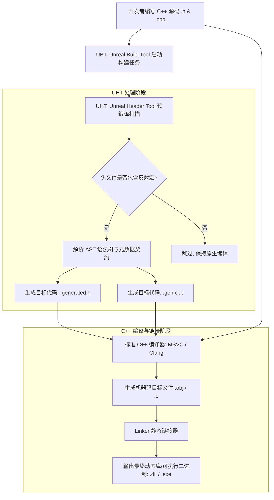
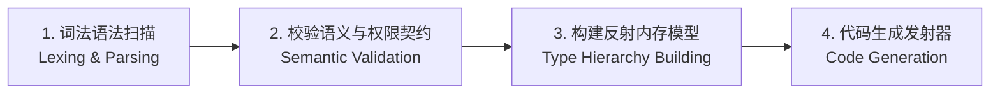
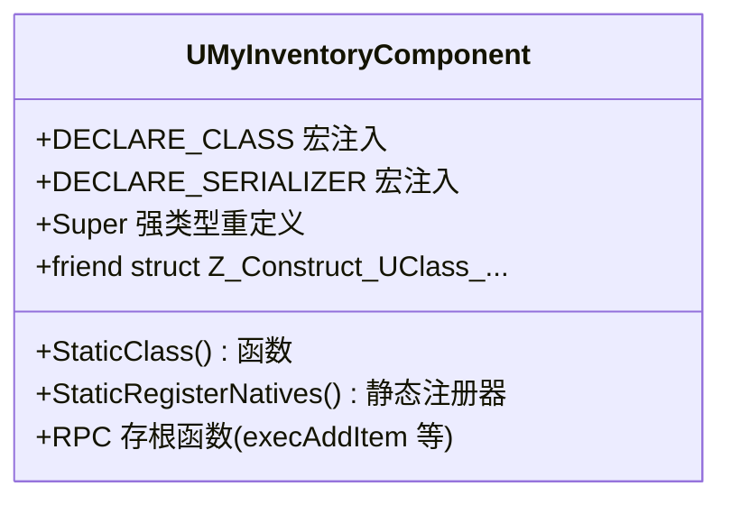
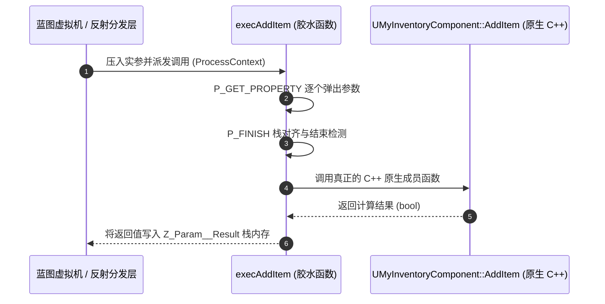

## 前言：标准 C++ 的缺憾与虚幻引擎的反射梦

在现代计算机语言生态中，C#、Java 等语言拥有完备的原生反射（Reflection）能力，程序在运行时可以轻易查询自身的类名、成员变量、方法签名并完成动态调用与序列化。

然而，标准 C++ 始终坚持“**零成本抽象（Zero-overhead principle）**”与“**为不使用的特性买单是不可接受的**”设计哲学。C++ 标准库提供的 RTTI（运行时类型识别，如 `typeid` 与 `dynamic_cast`）能力极其有限：
- 无法在运行时按字符串名称动态查找类或函数；
- 无法枚举某个类的所有成员变量及其内存偏移（Offset）；
- 无法在无侵入的前提下驱动通用的垃圾回收、网络复制与动态脚本绑定。

为了在极致追求运行性能的同时获得现代高级语言的动态特性，虚幻引擎（Unreal Engine）并未依赖笨重的第三方预处理器，而是自研了一套高度特化的编译器前端工具——**UHT（Unreal Header Tool，虚幻头文件工具）**。

今天这篇文章，我们将深入引擎底层工程腹地，全面拆解：**UHT 在引擎编译流水线中到底扮演了什么角色？我们在头文件中写下的 `GENERATED_BODY()` 到底展开成了什么？以及每个类对应的 `.generated.h` 与 `.gen.cpp` 究竟隐藏了怎样的源码玄机？**

---

## 一、UHT 在引擎构建流水线中的位置与使命

在虚幻引擎中，我们敲下“Build”或者在 IDE 中点击编译时，负责全局任务调度的并不是普通的 MSVC 或 Clang，而是引擎的元构建系统——**UBT（Unreal Build Tool）**。

UBT 会在真正的 C++ 编译器介入之前，优先调度 **UHT** 对所有包含反射标记的头文件进行预处理扫描：



### 1. UHT 的技术演进：从 C++ 到 C# .NET Core

很多老虚幻开发者记忆中的 UHT 还是一个由 C++ 编写的控制台程序（位于 `Engine/Source/Programs/UnrealHeaderTool`）。

从 **UE5** 开始，Epic Games 对 UHT 进行了彻底的现代化重构：
- **全面迁移至 C# / .NET 6/8：** 现代 UHT（位于 `Engine/Source/Programs/Shared/EpicGames.UHT`）完全使用现代 C# 重构，大幅提升了字符串处理效率、多核并行分析能力和跨平台维护性；
- **增量构建哈希（Incremental Caching）：** 现代 UHT 会为每个头文件计算精确的语法哈希。只有当头文件中的反射声明（`UCLASS`、`UPROPERTY` 等）发生实际变更时，才会重新覆写生成文件，极大减轻了 C++ 编译器的重新编译压力。

### 2. UHT 的工作流水线四步曲



1. **词法与语法扫描（Parsing）：** UHT 并非完整的 C++ 编译器，它是一套经过深度优化的针对性语法解析器。它会忽略函数体内的具体业务实现，专心寻找 `UCLASS()`、`USTRUCT()`、`UENUM()`、`UINTERFACE()`、`UFUNCTION()`、`UPROPERTY()` 以及关键锚点宏 `GENERATED_BODY()`；
2. **语义与权限巡检（Validation）：** 检查开发者声明的说明符是否合法。例如：私有变量标记了 `BlueprintReadWrite` 且未提供 `AllowPrivateAccess` 时，UHT 会在此阶段直接抛出编译错误并中止流程；
3. **反射拓扑构建（Hierarchy Building）：** 确认类的继承关系链、接口实现链以及成员内存对齐约束；
4. **胶水代码发射（Code Emitting）：** 依据收集到的反射元数据，向磁盘 `Intermediate/Build/.../Inc/` 目录写出对应的 `.generated.h` 与 `.gen.cpp`。

---

## 二、解密 `.generated.h`：编译期接口与结构缝合器

每一个声明了反射类的头文件，都必须严格遵守一个铁律：
在文件末尾包含 `#include "MyClass.generated.h"`，并在类体首行嵌入 `GENERATED_BODY()`。

```cpp
// MyInventoryComponent.h
#pragma once

#include "CoreMinimal.h"
#include "Components/ActorComponent.h"
#include "MyInventoryComponent.generated.h" // 必须是最后一个 include

UCLASS(ClassGroup=(Custom), meta=(BlueprintSpawnableComponent))
class MYPROJECT_API UMyInventoryComponent : public UActorComponent
{
    GENERATED_BODY() // 核心反射锚点

public:
    UPROPERTY(EditAnywhere, BlueprintReadWrite, Category="Inventory")
    int32 Capacity = 20;

    UFUNCTION(BlueprintCallable, Category="Inventory")
    bool AddItem(int32 ItemID);
};
```

那么，这个自动生成的 `MyInventoryComponent.generated.h` 内部到底装了什么？我们逐层拆解。

---

### 1. CURRENT_FILE_ID 与文件隔离唯一性

打开生成的 `.generated.h` 文件，首先会看到一组以宏哈希命名的预处理定义：

```cpp
#define FID_Source_MyProject_Public_MyInventoryComponent_h_12_GENERATED_BODY \
    // ... 大量宏注入 ...
```

这里的命名规则由 UHT 严格生成：
`FID_【模块相对路径】_【行号】_GENERATED_BODY`

#### 为什么不直接使用类名？
虚幻引擎支持在一个头文件中声明多个反射类/结构体。通过将**文件物理路径指纹与行号**绑定为唯一的宏标识符，UHT 可以绝对安全地将类体内的 `GENERATED_BODY()` 与头文件顶部生成的特定代码块一一精准对接，避免全局宏命名冲突。

---

### 2. `GENERATED_BODY()` 展开后的五大核心部件

当预处理器展开 `GENERATED_BODY()` 时，实际上是将以下关键代码原封不动地“偷梁换柱”注入进了你的类定义内部：



#### ① 类型别名与 Super 绑定
```cpp
public:
    typedef UActorComponent Super;
    typedef UMyInventoryComponent ThisClass;
```
这正是为什么我们在 C++ 子类的方法中可以随意使用 `Super::BeginPlay()`，而无需显式拼写庞大的父类完整名称。

#### ② `StaticClass()` 静态类型安全查询
```cpp
public:
    inline static UClass* StaticClass()
    {
        return GetPrivateStaticClass();
    }
```
它为该类型提供了全局静态类型访问入口，使得 `UMyInventoryComponent::StaticClass()` 可以极速获取对应的运行时 `UClass*` 元数据指针。

#### ③ `DECLARE_CLASS` 系列核心类特征声明
在 `.generated.h` 中会调用引擎底层的 `DECLARE_CLASS` 宏，展开后包含：
- 类静态标志位集合；
- 类默认对象（CDO）的私有访问器；
- 虚函数表（VTable）类型校验助手；
- `StaticRegisterNatives...()` 函数签名声明。

#### ④ 友元授权（Friend Declarations）
```cpp
friend struct Z_Construct_UClass_UMyInventoryComponent_Statics;
friend MYPROJECT_API UClass* Z_Construct_UClass_UMyInventoryComponent();
```
**关键设计意图：**
引擎在后续初始化反射属性（如私有变量 `Capacity`）时，负责构建元数据的外部全局函数需要读取或计算私有成员的内存偏移量。通过将外部构建函数 `Z_Construct_...` 声明为类的 `friend`，UHT 巧妙绕过了 C++ 的 `private` 访问权限限制，既维护了代码本身的良好封装，又赋予了反射系统全知全能的内省能力。

#### ⑤ 访问权限重置陷阱（Public vs Private）
细心的同学会发现：**紧跟在 `GENERATED_BODY()` 下方的一行，如果不写任何访问修饰符，默认是 `public:` 还是 `private:`？**

- 在旧版 `GENERATED_UCLASS_BODY()` 时代，宏展开末尾强制为你留了一个 `public:`；
- 在现代 **`GENERATED_BODY()`** 中，宏展开末尾会**恢复 C++ 类声明的天然默认权限——`private:`**！
- 因此，在 `GENERATED_BODY()` 下一行书写公共函数时，切记必须显式补充 `public:`。

---

## 三、剖析 `.gen.cpp`：运行时反射世界的“总装配车间”

如果说 `.generated.h` 负责**在类定义内部挖好插槽**，那么 `.gen.cpp` 则是**把这个类的所有血肉（函数签名、属性链表、反射标识）真正组装成二进制对象的车间**。

`.gen.cpp` 文件同样由 UHT 自动产出，并直接加入项目的编译文件树中，由标准 C++ 编译器编译进最终二进制库。

---

### 1. 函数执行存根（RPC 与蓝图虚拟机的 execThunk）

如果你在类中声明了一个 `UFUNCTION(BlueprintCallable)` 或 `UFUNCTION(Server, ...)`，UHT 会在 `.gen.cpp` 中为你生成一个名为 `exec...` 的胶水函数：

```cpp
// 自动生成的蓝图/反射执行存根
DEFINE_FUNCTION(UMyInventoryComponent::execAddItem)
{
    P_GET_PROPERTY(FIntProperty, Z_Param_ItemID); // 1. 从调用栈帧弹出实参
    P_FINISH;                                     // 2. 标记调用栈参数读取完毕
    
    P_NATIVE_BEGIN;                               // 3. 进入本地原生 C++ 上下文
    *(bool*)Z_Param__Result = P_THIS->AddItem(Z_Param_ItemID); // 4. 调用真实 C++ 函数并写入返回值
    P_NATIVE_END;
}
```



通过这一层统一的 `execThunk` 存根，虚幻的脚本虚拟机（Blueprint VM）无需了解具体 C++ 编译器在底层 ABI 上的参数传递规范（寄存器传递还是栈传递），统统按照字节流在内存栈上装配和解析参数，实现了极高兼容性的**跨语言/跨虚拟机动态调用**！

---

### 2. 静态元数据与属性偏移注册表

打开 `.gen.cpp`，你会看到大量以 `Z_Construct_...` 开头的函数，其核心逻辑由一个静态结构体驱动：

```cpp
struct Z_Construct_UClass_UMyInventoryComponent_Statics
{
    // 类静态函数导出表
    static const FClassFunctionLinkInfo FuncInfo[];
    
    // 属性元数据配置结构体（记录类型、标志位、偏移量）
    static const UECodeGen_Private::FIntPropertyParams NewProp_Capacity;
    
    // 属性指针集合
    static const UECodeGen_Private::FPropertyParamsBase* const PropPointers[];
    
    // 类依赖信息
    static UObject* (*const DependentSingletons[])();
};
```

来看其中最精妙的属性初始化配置：

```cpp
const UECodeGen_Private::FIntPropertyParams Z_Construct_UClass_UMyInventoryComponent_Statics::NewProp_Capacity = {
    "Capacity",                                        // 属性名称
    nullptr, 
    (EPropertyFlags)0x0010000000000001,                // 属性标志: CPF_Edit | CPF_BlueprintVisible
    UECodeGen_Private::EPropertyGenFlags::Int, 
    0, 
    0, 
    1, 
    STRUCT_OFFSET(UMyInventoryComponent, Capacity),    // 核心黑魔法: 计算内存相对偏移!
    METADATA_PARAMS(...)                               // 编辑器元数据字典
};
```

> 💡 **核心底蕴：`STRUCT_OFFSET` 的威力**  
> `STRUCT_OFFSET(UMyInventoryComponent, Capacity)` 在编译期直接通过 C++ 的宏计算出变量 `Capacity` 相对于类起始地址的字节偏移行距（Offset）。  
> 这意味着：在运行时，反射系统无论要读取还是写入一个实例的属性，**根本不需要知道具体指针类型，只需要 `(uint8*)Instance + Offset` 即可零开销瞬间定址目标内存！**

---

### 3. Z_Construct_UClass 惰性单例构造器

整个 `.gen.cpp` 最核心的枢纽函数是：

```cpp
UClass* Z_Construct_UClass_UMyInventoryComponent()
{
    if (!Z_Registration_Info_UClass_UMyInventoryComponent.OuterSingleton)
    {
        // 惰性双重检查单例模式构造
        UECodeGen_Private::ConstructUClass(
            Z_Registration_Info_UClass_UMyInventoryComponent.OuterSingleton,
            Z_Construct_UClass_UMyInventoryComponent_Statics::ClassParams
        );
    }
    return Z_Registration_Info_UClass_UMyInventoryComponent.OuterSingleton;
}
```

它遵循**惰性初始化模式（Lazy Evaluation）**：
- 只有在第一次被请求访问时，才会调用 `ConstructUClass` 构造真正的 `UClass` 原型对象；
- 返回的指针被全局静态变量缓存，保证全进程唯一。

---

### 4. 静态登记助手：在 main() 执行前悄悄入列

既然 `Z_Construct_...` 是惰性调用的，那么引擎在启动时，怎么知道整个工程里一共有多少个类呢？

在 `.gen.cpp` 的最底部，藏着一个看似毫不起眼的静态全局变量：

```cpp
static FDelayedAutoRegisterHelper DelayedAutoRegister(
    EDelayedRegisterType::UClass,
    TEXT("UMyInventoryComponent"),
    &Z_Construct_UClass_UMyInventoryComponent,
    ...
);
```

#### 运作原理
利用了 C++ 的语言特性：**全局静态对象的构造函数会在可执行程序进入 `main()` 函数之前、或者模块动态库（DLL）被 `LoadLibrary` 载入内存的瞬间自动执行！**

`FDelayedAutoRegisterHelper` 在其构造函数中，迅速将指向 `Z_Construct_UClass_UMyInventoryComponent` 的函数指针推入全局待注册链表（`TArray`）。

这样，当引擎启动完成底层基础内存分配后，只需要遍历这个全局链表，便能将游戏中的所有反射类型一网打尽！

---

## 四、UHT 代码生成全景总结与结构对照

为了方便直观理解，我们用一张对照表总结 `.h` 源码输入与 `.generated.h` / `.gen.cpp` 输出的映射关系：

| 开发者 C++ 源码写法 | UHT 代码生成归宿 | 最终在引擎中起到的作用 |
| :--- | :--- | :--- |
| **`#include "MyClass.generated.h"`** | 引入生成的接口头文件 | 在正式编译前打通预编译宏命名空间，建立绑定通道 |
| **`GENERATED_BODY()`** | `.generated.h` 中的宏定义 | 注入 `StaticClass()`、`Super` 别名、`DECLARE_CLASS` 序列化与友元授权 |
| **`UFUNCTION(BlueprintCallable)`** | `.gen.cpp` 中的 `DEFINE_FUNCTION(exec...)` | 生成脚本虚拟机的栈帧解包存根（Thunk），支持反射无缝调用 |
| **`UPROPERTY(EditAnywhere)`** | `.gen.cpp` 中的 `FPropertyParams` 静态描述 | 计算属性在类内的字节偏移量（`STRUCT_OFFSET`），录入元数据字典 |
| **`UCLASS(...)` 声明整体** | `.gen.cpp` 中的 `FDelayedAutoRegisterHelper` | 利用全局静态初始化机制，在模块载入期将类构造函数登记进引擎注册表 |

---

## 结语与下篇引申

通过本篇对 UHT 的全面解密，我们看清了虚幻引擎在**编译期**为我们搭建的宏伟骨架：
UHT 就像一位不知疲倦的“代码编织工”，将高度精炼的宏标记，自动翻译成由 `.generated.h`（结构注入）与 `.gen.cpp`（注册构造）构成的庞大反射胶水网。

**然而，故事才刚刚开始：**
- 当这些静态函数指针被推入 `FDelayedAutoRegisterHelper` 后，引擎启动时究竟是如何一步步将它们唤醒的？
- 内存中的 `UClass`、`UField`、`FProperty` 到底长什么样？
- 为什么 UE 4.25 痛下决心将 `UProperty` 废弃并重构成 `FProperty`？
- 这些反射对象又是如何同时为**垃圾回收（GC）**、**网络属性复制**和**蓝图虚拟机**提供核心动力的？

敬请期待下篇——**《UE5 反射系统与底层架构深度解析（下）：运行时元数据对象系统与 UClass 启动装载生命周期》**！
